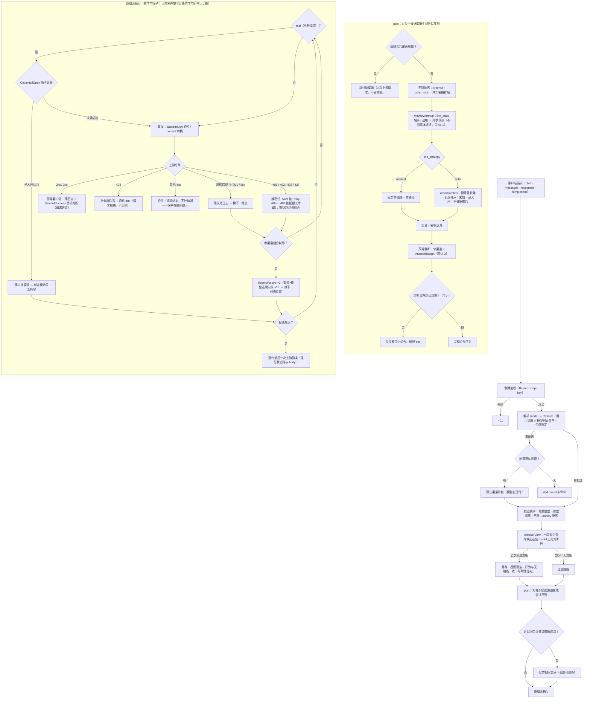
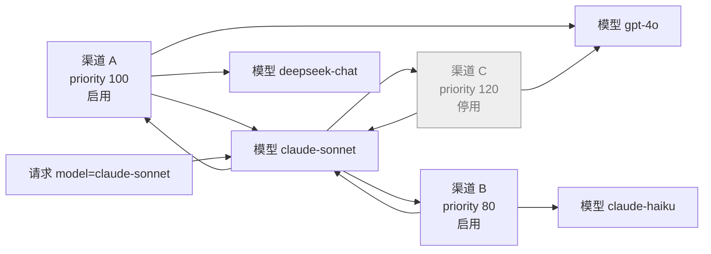
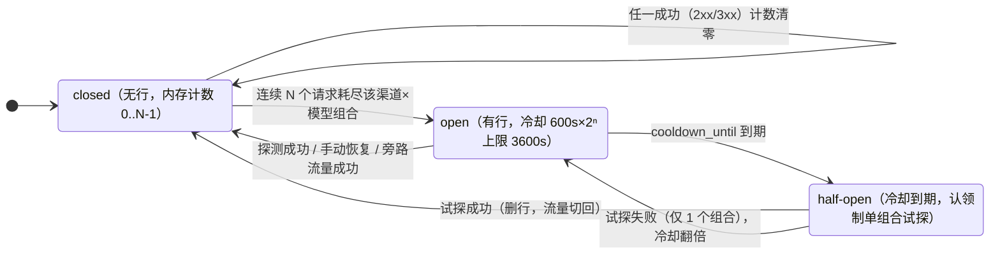
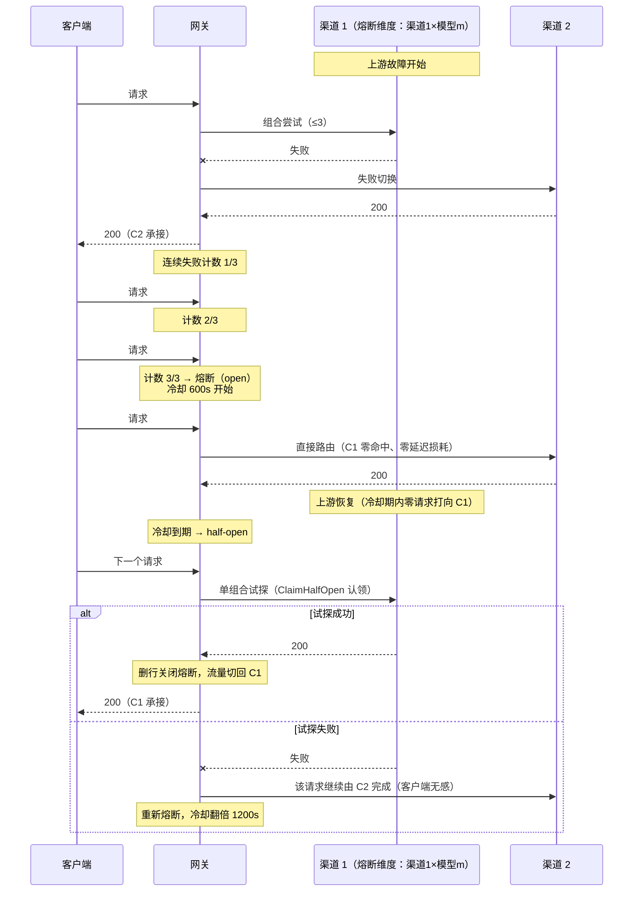
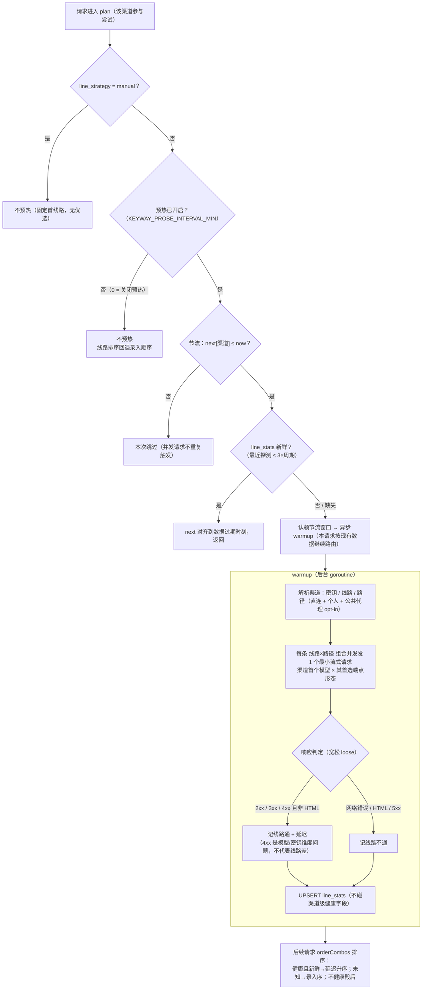

# Keyway 技术方案（DESIGN）

- 版本：v1.49（与 PRD v1.5.52 对应；管理页统计**补齐按渠道维度表**——后端
  `usage.QueryStats` 的 `byChannel` 分组（含价目补算 `mergeCost(st.ByChannel)` 与
  `applyIDNames` 渠道名显示，已删除渠道回退 `#id`）与管理端 CSV 导出本就具备，
  用户侧统计页（Stats.tsx）也已渲染；管理页 Admin.tsx StatsTab 此前只渲染
  byUser/链路状态/byModel，全员渠道维度（含公共默认渠道）的费用分布不可见。
  现在按用户表后新增「按渠道」Card，复用 groupColumns（请求数/tokens/费用/
  错误，列可排序）与既有时间窗；无后端改动，纯前端补渲染；
  前版 v1.48：与 PRD v1.5.51 对应；失败切换新增 **402 计费限额耗尽**（FR-K4
  扩展）——上游 402 是中转/聚合型网关的计费限额语义（OpenRouter insufficient
  credits、Team weekly spending limit 类；官方 API 配额耗尽走 429 不用 402），
  旧实现落入「其他 4xx 透传」：原样回客户端、不换 key、不计熔断，限额耗尽的
  渠道被持续打到。现提取 `keyLevelStatus`（401/402/403/429）为密钥级错误：
  chat/responses 管线换 key 重试并对该 key 设长冷却（`keyErrorCooldown`：
  429 按 Retry-After 缺省 `KEYWAY_KEY_COOLDOWN_S`，402 按
  `KEYWAY_QUOTA_COOLDOWN_S` 默认 3600s、≤0 回落 3600——限额多为天/周级，
  短期重试同一把 key 必然失败），渠道组合耗尽由段落统一计熔断失败后换下一
  渠道；透传型管线（completions/embeddings）402 经 `recordUpstreamOutcome`
  计熔断失败（同 401/403/429 口径）。顺带修复 responses 管线熔断 last_error：
  密钥级错误/5xx 分支此前不写 lastErr，段落耗尽时错误摘要缺失或沿用网络错误
  旧值，现统一记录末次失败摘要（对齐 chat 管线 segErr 与 v1.5.46 ⑤）。
  测试：402 换 key（chat，单渠道双 key 同上游按 Authorization 区分）+ 402 切
  渠道（responses，Team weekly spending limit 场景复现）e2e，断言密钥长冷却/
  最近错误与逐次尝试日志（failover_test.go）；
  前版 v1.47：与 PRD v1.5.50 对应；新增**用户配置导出/导入**（FR-BK1~BK5）——
  `internal/api/backup.go`：`GET /api/config/export?secrets=1|0` 导出本人密钥池/
  渠道/令牌快照为明文 JSON 附件（完整模式解密包含密钥值/令牌明文/个人代理地址，
  纯结构不含任何明文）；文件契约 version=1：`app/format/version` 头自描述，密钥以
  **名称**为引用键（每用户内唯一、跨实例可读），渠道以**文件内 id**（导出时 DB id）
  为引用键，已吊销令牌不导出。`POST /api/config/import` **合并导入**（单事务，
  硬错误整体回滚）：同名密钥复用不覆盖值；渠道/令牌一律新建（同名加序号后缀
  c1 → c1(2)）；密钥绑定按名称重映射（悬空丢弃）；全部密钥悬空的渠道以草稿
  （停用）导入；令牌含明文按明文重建（跨实例迁移 Agent 零改配，key_hash 全局
  唯一——重复导入或他人持有同值令牌跳过），无明文随机签发；渠道绑定按文件内
  id 重映射（被跳过的渠道引用丢弃，≤20）。**同名一律跳过复用**（密钥/渠道/令牌），
  重复导入幂等不产生副本；渠道同名跳过时仍建立 id 映射（令牌绑定落到现有渠道）。
  条目级问题跳过并计入 result.warnings；4MB 上限 + UTF-8 BOM 容错。
  前端 `BackupModal`（用户菜单入口，i18n backup 模块）双页签：导出模式单选 +
  明文警示 + blob 下载；导入上传 + 结果计数（密钥新建/复用、渠道新建/复用/草稿、
  令牌新建）与注意事项清单。测试：双模式导出、跨实例迁移（旧令牌零改配请求
  成功）、同实例合并（同名复用/跳过、幂等无副本）、纯结构草稿导入与重复导入
  幂等、非法文件 400 的 e2e；
  前版 v1.46：与 PRD v1.5.49 对应；链路状态分级与分组视觉修订——①**质量分级
  只看错误率**（可靠性）：优 <5%、良 <20%、差 ≥20%，样本 <5 次不评级，熔断单独
  分级；原"优 = 错误率 <5% 且 ≤1.5× 模型内最优"令可靠性与速度互相拉踩
  （0% 错误率高延迟会低于 1% 错误率低延迟），现速度对比独立放在延迟列（相对
  模型内最优的倍数 ×N.N 与着色，基准仍排除快速失败渠道）；②模型分组改为
  **分组头行**（首列 colSpan 横跨整行：模型名 + 渠道数/尝试数/组内错误率，
  `.links-group-header` 主题变量背景 + 左侧竖条 + 上下边框，替代原 rowSpan
  合并单元格，组间分割一目了然）；
  前版 v1.45：与 PRD v1.5.48 对应；链路状态改为**同模型对比视图**——原平铺表
  无对比意义。`LinksTable` 按模型分组：组内渠道按质量排序（未熔断在前 → 错误率
  升序 → 延迟升序，熔断沉底），模型按窗口内总尝试数降序；模型列 rowSpan 合并。
  新增质量分级（优/良/差/熔断/样本不足，颜色编码）：优 = 错误率 <5% 且平均延迟
  ≤1.5× 模型内最优、良 = <20% 且 ≤3×、差 = 其余、样本 <5 次不评级；延迟基准
  取模型内样本充足（≥5 次）且错误率 ≤10% 组合的最小平均延迟——快速失败的渠道
  （高错误率低耗时）不会成为基准；延迟列着色并显示相对倍数（×N.N）；样本充足
  且组内第一的组合标注「最优」；熔断分级悬停含失败次数/下次试探/最近错误。
  纯前端改造，API 与数据口径不变）；
  前版 v1.44：与 PRD v1.5.47 对应；新增**渠道×模型链路状态**（FR-B7）——统计页
  「链路状态」与管理端全局视角。`usage.QueryLinks` 按（channel_id, model）GROUP BY
  logs 聚合窗口内的全部**上游尝试**（v1.5.42 起逐次尝试各记一条，口径与统计一致：
  失败切换的中间尝试计入），输出请求数/成功数/错误率/平均耗时/最近尝试；
  API 层 `linksResponse` 补渠道名（管理端另补所有者用户名）并叠加
  `breaker_states` 当前熔断快照——**熔断中的组合即使窗口内零尝试也补零行展示**
  （熔断的本意就是无流量，状态可见性不依赖流量）；渠道已删的行剔除。
  权限口径：`GET /api/stats/links`（本人渠道，统计页）与
  `GET /api/admin/stats/links`（全量渠道 + 所有者列，管理端全局视角——多租户
  BYOK 下渠道是租户私有资产，全量明细仅管理员可见）。前端共用
  `LinksTable` 组件（渠道/模型/请求数/错误率/平均延迟/最近请求/熔断列，熔断列
  Tooltip 含失败次数、下次试探时间与最近错误，管理端多一列所有者），随统计页
  时间窗联动。测试：QueryLinks 聚合单测（尝试口径/错误率/平均耗时/用户隔离/
  全员口径/时间窗）+ e2e（用户只见自己渠道、管理端全量含所有者、熔断叠加与
  零尝试补行、渠道删除后不可见）；
  前版 v1.43：与 PRD v1.5.46 对应；熔断器与按需预热评审修复。① `RecordFailure`
  退避进度以 DB 行 fail_count 为准推进（max(行+1, 本地计数)，乐观锁 + 重试防并发
  丢失更新，首次落行 OnConflict DoNothing）——重启后本地计数归零不降级已持久化
  的进度、不缩短既有冷却；② `ClaimHalfOpen` 先读行再原子认领，冷却顺延到**下一
  退避档**（与试探失败后 RecordFailure 写入值一致），非计入型收尾（如 400 透传）
  不回退进度；③ 预热 `saveResults` 拆出 updateChannel 开关——宽松判定只落
  line_stats，不误刷渠道 last_ok_at（线路通 ≠ 渠道健康），「测试渠道」严格判定
  才更新渠道级字段；④ `MaybeWarmup` 前置校验（无模型/无线路）不消耗节流窗口；
  ⑤ completions-embeddings 管线熔断 last_error 记末次失败摘要；⑥ 新增
  `PruneModels`：渠道改配移除模型后清理其熔断行与计数（默认渠道承接任意模型，
  调用方不清理）；⑦ breaker.New 上限低于基础冷却时 clamp 到基础冷却。测试：
  重启不降级/认领退避档/上限收敛/PruneModels 单测 + 改配清理 e2e，预热断言改为
  不刷 last_ok_at）；
  前版 v1.42：与 PRD v1.5.45 对应；新增**渠道×模型熔断器**与**按需线路预热**
  （移除定时探测循环）。熔断器 `internal/breaker`：`breaker_states` 表（复合主键
  channel_id+model）只保存熔断中的行（无行 = 关闭），低于阈值的连续失败计数在
  引擎内存（mutex map，重启清零）。relay 三条管线（chat `relay()` / responses /
  completions-embeddings）以 `breakerView` 在生成尝试计划前查询候选渠道熔断状态：
  熔断且冷却未到期 → 整渠道跳过；冷却到期（半开）→ 仅放行首个组合并标记
  `trial`，执行时经 `ClaimHalfOpen` 原子认领（`UPDATE ... WHERE cooldown_until
  <= now` 顺延一个周期，认领失败即跳过该渠道，保证半开单飞且不消耗高优先级
  渠道持续成功时的试探窗口）；**全部候选熔断 → 旁路**（返回 nil view，行为与
  无熔断一致，可用性优先，旁路期间真实流量成功同样关闭熔断）。失败记录按
  「渠道分段耗尽」粒度：一个请求把该渠道该模型组合全部尝试耗尽 →
  `RecordFailure` 一次（连续 N 次达阈值 3 即熔断，冷却 600s 失败指数退避 ×2
  上限 3600s）；请求以 2xx/3xx 收尾、半开试探成功或「测试渠道」探测成功 →
  `RecordSuccess` 关闭；404 与透传型管线的 401/403/429 直接计失败（404 为
  模型维度故障形态），其余 4xx 不计。API：`GET /api/breakers`（本人渠道熔断
  明细）、`POST /api/breakers/reset`（手动恢复，model 空 = 整渠道；删除渠道
  联动清理）；前端渠道列表新增「熔断」列（红标 + Popover 明细 + 单个/全部
  恢复）。**定时探测循环移除**：`probe.Engine` 不再有 Start/scanOnce，多线路
  优选改为**按需预热**（`MaybeWarmup`，relay.plan 对参与尝试的渠道触发）：
  line_stats 缺失或超过 3 个 `KEYWAY_PROBE_INTERVAL_MIN` 周期（默认 30 分钟，
  0=关闭）时异步补一次线路质量探测——每线路×路径一个最小请求（渠道首个模型），
  `probeOne` 新增 loose 语义：任意 <500 非 HTML 响应记通并取延迟（4xx 是模型/
  密钥维度问题）；有流量渠道按流量节拍保鲜、无流量零成本，next map 节流防并发
  重复；「测试渠道」按钮保留全矩阵诊断（模型回退 + 严格判定），成功联动关闭
  熔断。环境变量：`KEYWAY_BREAKER_FAIL_THRESHOLD`=3、
  `KEYWAY_BREAKER_COOLDOWN_S`=600、`KEYWAY_BREAKER_COOLDOWN_MAX_S`=3600。
  测试：breaker 单测（阈值/退避封顶/半开认领单飞/手动恢复/模型隔离，注入
  时钟）+ e2e（跳过/模型维度/旁路/半开单组合试探与切回/探测恢复/手动恢复
  与越权/Responses 管线）+ 预热单测（宽松判定/节流与开关））；
  前版 v1.41：与 PRD v1.5.44 对应；统计**按令牌筛选**——`usage.QueryStats` 追加可选
  `tokenID` 参数，在基础条件上叠加 `token_id = ?`，汇总/分组（byChannel/byModel/byKey/
  byUser）/未定价补算（复用 base 闭包）/最近生效流量（recent 子查询单独追加）全部限定
  到该令牌；`logs` 表补建 `idx_logs_token(token_id, created_at)` 索引（store.go
  `ensureLogsIndexes`，与 channel/key 同构）；API 层 `queryTokenID` 解析可选 `tokenId`
  查询参数，`GET /api/stats`、`/api/stats/export`、`GET /api/admin/stats`、
  `/api/admin/stats/export` 四端点生效（管理页 UI 一期未提供入口）；前端统计页
  （`pages/Stats.tsx`）时间窗旁新增令牌下拉（`listTokens` 数据源，含已吊销令牌并标注），
  选中后刷新查询；`StatsRange` 类型新增 `tokenId`；i18n 新增 `stats.token`；
  用户视角 user_id 与 token_id 双条件叠加，传他人令牌 id 天然查不到数据；
  测试覆盖「按令牌过滤汇总/分组/recent + 跨用户隔离 + 管理员按令牌下钻」；
  前版 v1.40：与 PRD v1.5.43 对应；渠道/模板列表**直接展示模型列表**——新增共享
  组件 `web/src/components/ModelTags.tsx`：行内平铺前 5 个模型 Tag，超出部分收进
  「+N」Tag 的 Popover（标题显示总数，内容区 maxWidth 360 / maxHeight 280 滚动
  浏览全部），适配模型较多的渠道；渠道列表（`pages/Channels.tsx`）新增「模型」列，
  管理员模板列表（`pages/Admin.tsx` TemplatesTab）「模型数」数字列改为模型列表，
  两者复用同一组件；i18n 新增 `common.allModelsCount`，移除弃用的
  `admin.modelCount`；
  前版 v1.39：与 PRD v1.5.42 对应；请求日志**逐次上游尝试各记一条**——修复失败
  切换只记最后一条失败日志的问题：旧实现中间渠道的失败不留痕，排障时无法判断
  "哪些渠道被尝试过"（channel_id 显示的是最后一次尝试的渠道，有误导性）；现
  chat / responses / completions-embeddings 三条管线（`relay/handlers.go`）在每个
  失败组合发生时即调 `submitFailureLog` 落一条失败日志，错误摘要复用探测的
  `probe.UpstreamErrorSummary` 解析上游响应体 message（`上游 %d：message` 同
  格式），网络错误记 502、HTML 回退记 502 + 端点不存在；最终成功另行一条；
  统计口径随之变为真实上游请求次数；测试覆盖「3 条线路失败 + 1 成功 = 4 行日志
  （含错误摘要与渠道归属）」；
  前版 v1.38：与 PRD v1.5.39 对应；失败切换**预算改为按渠道粒度**——修复
  attempt 预算跨渠道共享导致的切换失效：旧实现把 `KEYWAY_ATTEMPT_BUDGET`
  （默认 3）截断作用在全部候选渠道的组合总和上，首渠道多条线路/多把密钥即可
  耗尽整个预算，后续渠道（含令牌限定的次优先级渠道）完全不参与尝试、503 直接
  透传（违反 FR-K5「组合尝试上限 3 次，仍失败 → 换渠道」与 A9）；现改为
  **单渠道组合数 ≤ budget，组合耗尽 → 换下一候选渠道，全部渠道耗尽才透传**，
  chat 管线（`relay.plan`）与 responses/passthrough 管线（逐渠道 `planFor`）
  行为对齐；`plan` 同时对 matched+defaults 双命中的同一渠道去重（第二轮重试
  必然同样失败）；新增端到端测试覆盖「渠道1 多线路全部失败仍切换渠道2」
  （failover_test.go，chat 与 responses 双管线）；
  前版 v1.37：与 PRD v1.5.39 对应；前端**中英文切换与亮暗色主题**——① 自建轻量
  i18n（`web/src/i18n/`，无第三方依赖）：LocaleProvider + `useI18n().t(key,
  params)`，扁平 key 字典按页面拆分（common/layout/login/register/keys/channels/
  models/templates/tokens/guide/logs/stats/admin，共 482 key）；zh 字典为类型源
  （`DictKey = keyof typeof zh`），en 字典以 `satisfies Record<DictKey, string>`
  编译期校验 key 完整性；Provider 同步 antd locale（zh_CN/en_US）、dayjs locale
  与 `<html lang>`，并经 `setApiTranslator` 向 `api/client.ts` 注入翻译函数
  （非组件层的「请求失败（status）」兜底文案本地化）；语言持久化 localStorage
  （kw-locale，默认中文）；Guide 代码示例保持原样不翻译（可直接复制使用）；
  ② 主题（`web/src/theme.tsx`）：ThemeProvider（light/dark）+ localStorage
  （kw-theme），`initTheme()` 在 React 渲染前同步 `<html data-theme>`（防暗色
  刷新闪一帧亮色），未设置时跟随 prefers-color-scheme；antd 走算法切换
  （darkAlgorithm + 暗色 token 映射：布局底 #0e1417、头/侧栏 #121a1f、主色
  提亮 #3f96b0、表头 #162027 等），自定义样式全量 CSS 变量化（styles.css
  `:root` 与 `:root[data-theme='dark']` 双套取值），页面内联硬编码色改用
  `var(--kw-*)`（代码块/浅色块/边框/主色等）；③ 控制台头部新增语言
  （TranslationOutlined，显示目标语言缩写）与主题（Sun/MoonOutlined）切换按钮；
  前版 v1.36：与 PRD v1.5.38 对应；前端**移动端适配**——Layout 用
  `Grid.useBreakpoint`（`screens.lg === false` 判定，首帧按桌面渲染防闪烁）
  在窄屏（<992px）切换为头部汉堡按钮 + Drawer 抽屉导航（width 280，菜单/品牌
  与侧栏复用同一 JSX）；各列表与分组 Table 统一加 `scroll={{ x: 'max-content' }}`
  （列不再挤压，窄屏横向滚动）；styles.css 移动端媒体查询（≤768px）扩充：
  Modal `max-width: calc(100vw - 16px)` + content 限高 `100dvh` 纵向滚动、
  Modal 内 Input/InputNumber/Select/Picker `max-width: 100%`、Space 自动换行、
  Popover 限幅视口内、表格单元格 8px 紧凑、汇总带大数字缩小；Stats 页
  按渠道/按模型两列 `Col` 补 `xs={24}` 窄屏堆叠；index.html viewport 补
  `viewport-fit=cover` 与 `theme-color`；
  前版 v1.35：与 PRD v1.5.37 对应；最近生效流量**线路列左移**（撤销 v1.34 的
  列序交换）——渠道列改定宽 130（auto 平分曾占约 1/3 表宽把线路列挤右），
  线路列加宽至 260；列序维持 时间 → 渠道 → 线路 → 模型 → 状态；
  前版 v1.34：与 PRD v1.5.36 对应；最近生效流量**列序调整**——「线路」列左移
  至「渠道」前，线路作为实际路由结果先于渠道名扫读；
  前版 v1.33：与 PRD v1.5.35 对应；线路 URL **分层短显**——新增 `LineUrl`
  组件（统计页最近生效流量 + 日志页线路列共用）：域名主体 + 路径弱色展示、
  悬停 Tooltip 显示完整地址（含 via），列定宽 + ellipsis 超长省略
  （`showTitle:false` 避免原生 title 与 Tooltip 双浮层）；
  前版 v1.32：与 PRD v1.5.34 对应；tokens 汇总**紧凑单位显示**——统计汇总条
  「tokens（入/出）」改用 `fmtTokens`（3 位有效数字 K/M/B 紧凑单位，先取整再
  定档：999,999 直接进位 1M），悬停 Tooltip 显示入/出千分位精确值；分组表
  维持 `fmtInt` 精确等宽数字，列内逐位可比口径不变；
  前版 v1.31：与 PRD v1.5.33 对应；最近生效流量**补充实际路由线路维度**——
  `stats.recent`（LatestUsage）新增 `lineUrl`/`via` 字段，去重查询口径不变
  （仍按渠道×模型取 MAX(id) 最新一条），线路随该行一并取
  `COALESCE(line_url,'')`/`COALESCE(via,'')`；统计页最近生效流量表新增「线路」
  列（line_url 主显 + via 弱色后缀，历史日志无线路数据回退 —）；
  前版 v1.30：与 PRD v1.5.32 对应；前端**数字/货币展示精细化**——自托管 Inter
  字体（`@fontsource/inter` 400–800 字重，修复 fontFamily 声明 Inter 但从未加载、
  `$`/`%`/数字实际渲染在系统中文字体上的问题）；新增 `Money` 组件统一货币展示
  （`$` 符号小一号弱色、统计带大数字模式弱化费用小数拖尾、`%` 后缀弱化），
  `format.ts` 拆出 `fmtCostParts`（sym/int/dec 三段）供分层渲染，`fmtCost` 移除；
  覆盖统计/日志/管理页费用、模型目录单价、价目表价格列；
  前版 v1.29：与 PRD v1.5.31 对应；管理员统计**补齐按用户维度**（FR-M3/US11/A14
  原有要求，实现缺失）——`QueryStats` 管理员模式（userID=nil）新增 `stats.byUser`
  分组：按用户聚合请求数/tokens/费用/错误，id→用户名（已删除回退 `#id`）；
  **零用量用户从 users 表补齐**（GROUP BY logs 不会为无日志用户产生行）；
  价目补算查询补选 user_id 列、补算费用合入用户分组；`/api/admin/stats/export`
  CSV 新增"用户"维度行；管理统计页升级为时间窗选择 + 汇总条 + 按用户表 +
  按模型表 + 导出 CSV 按钮；
  前版 v1.28：与 PRD v1.5.30 对应；飞书自动建号**用户名直接取飞书昵称**（保留
  中文，去空格截断 32 字符，重名加随机后缀，空昵称回退占位名）——旧逻辑仅保留
  ASCII 字符，中文昵称被清洗为空、回退 `feishu-user` 占位名；存量占位名账号在下次
  飞书登录时自愈为当前昵称（healFeishuUsername，被占用则不变）；
  前版 v1.27：最近生效流量**同渠道同模型去重**——按
  （channel_id, model）分组取 MAX(id)（每组最新一条成功日志），再取最近 5 个组合，
  连续使用同一渠道+模型不再占满列表；
  前版 v1.26：限定渠道支持全部关闭（tokens 新增 `restricted`
  列区分"不限"（0）与"限定"（1，空启用集合 = 全部临时停用、路由零候选），
  路由过滤语义改为"非 nil = 限定（空切片零候选）、nil = 不限"（RouteFilter），
  撤销"至少保留一个启用渠道"守卫——临时关闭与吊销语义不同；
  前版 v1.25：探测端点优先级与流式探测；v1.24：移除限定主开关（令牌始终按面板
  列表顺序路由，消除"不限按渠道优先级 / 限定按面板顺序"两套规则的歧义；存量
  "不限"令牌打开面板以全部渠道按优先级预览、首次调整即固化；拖拽引入
  **@dnd-kit/sortable**（首个前端交互类运行时依赖，按压 4px 进入拖拽、让位动画、
  触屏可用），替换原生 HTML5 DnD）；
  前版 v1.23：探测覆盖 /v1/responses 端点形态；
  前版 v1.22：限定渠道面板交互逻辑修正——胶囊入口固定宽度、至少保留一个启用渠道、
  主开关重开恢复上次启用集合（会话级记忆）、拖拽热区收敛到行首手柄；
  前版 v1.21：探测模型回退与错误摘要；v1.20：探测协议判定对齐真实转发、探测矩阵
  并发化；v1.19：限定渠道面板体验修正；v1.18：模型目录价目点选；v1.17：流式保活
  与止损、usage 兜底估算；v1.16：撤销目录价目导入与价格展示优化；
  v1.15：令牌渠道顺序与启用集合分离；v1.14：统计页名称化/补算/时间窗/最近流量；
  v1.13：限定渠道面板交互优化；
  历史变更见文档各节与 PRD 变更记录）
- 日期：2026-09-18
- 关联文档：docs/PRD.md
- 本文档解决：架构、技术选型、数据模型落地、核心机制设计、协议转换决策表（PRD 开放
  问题 Q4）、API 设计、部署、测试与实施计划

---

## 1. 总体架构

单进程单二进制，前端静态资源经 go:embed 内嵌，SQLite 落盘，无外部依赖。

```
                         ┌──────────────────────── keyway 进程 ────────────────────────┐
Agent ──HTTPS 443──▶ 反代 ─▶│ gin Router                                               │
(Claude Code/Cline)        │  ├─ /v1/*            relay 层（鉴权→路由→转换→转发→日志） │
                           │  ├─ /api/*           console 层（Web 会话鉴权）           │
                           │  ├─ /oauth/feishu/*  飞书回调                              │
                           │  └─ /healthz                                                     │
                           │                                                            │
                            │  核心服务：                                                  │
                             │  routing   路由/优选/失败切换（内存缓存 + 写失效）            │
                             │  breaker   渠道×模型熔断（失败计数/探测·手动恢复）          │
                             │  convert   OpenAI ↔ Anthropic 双向转换（含流式）             │
                            │  proxyman  出站代理池（按代理复用连接、字节统计）             │
                            │  probe     按需线路预热 + 测试按钮矩阵（无定时循环）           │
                            │  fxrate    USD→CNY 汇率定时同步（auto 模式生效）              │
                            │  usage     异步日志批写 + 费用快照 + 保留期清理               │
                            │  store     GORM + SQLite(WAL)                                │
                           └────────────────────────────────────────────────────────────┘
                                     │ 直连 / 个人代理 / 公共代理
                                     ▼
                          上游线路 1..n（openai 型 / anthropic 型）
```

关键取舍：

| 决策 | 选择 | 理由 |
|---|---|---|
| 语言 | Go 1.23+ | 单二进制、流式/并发模型成熟、CGO-free 交叉编译 |
| Web 框架 | gin | 生态熟、中间件模型清晰 |
| 存储 | SQLite（glebarez/sqlite，modernc 纯 Go 驱动）+ GORM | 无 CGO，docker 镜像可 distroless；WAL 满足写并发 |
| 前端 | Vite + React + TS + Ant Design 5 + @dnd-kit/sortable | 控制台型 UI 开发效率；排序拖拽（手柄热区、让位动画、触屏） |
| 会话 | DB-backed 不透明 token（HttpOnly Cookie） | 服务端可即时吊销（用户禁用即全端下线） |
| 密钥加密 | AES-256-GCM，主密钥来自环境变量 | PRD G4：防拖库 |
| 流式 | 自定义 handler + http.Flusher，不缓冲 | PRD FR-R4 |

## 2. 代码结构

```
keyway/
├── docs/                    # PRD.md / DESIGN.md
├── server/
│   ├── cmd/keyway/main.go
│   └── internal/
│       ├── config/          # 环境变量加载与默认值
│       ├── store/           # GORM 模型、迁移、仓储
│       ├── crypto/          # aesgcm、bcrypt、令牌生成
│       ├── auth/            # 会话、网关令牌查找、飞书 OAuth
│       ├── api/             # /api console 处理器（按资源分文件）
│       ├── relay/           # /v1 入口：openai.go / anthropic.go / models.go
│       ├── convert/         # 转换器（见 §7）+ 金样本测试夹具
│       ├── routing/         # 渠道模型路由、attempt plan、失败切换、缓存失效
│       ├── breaker/         # 渠道×模型熔断器（失败计数/探测·手动恢复）
│       ├── probe/           # 按需线路预热 + 测试按钮矩阵（成功联动关闭熔断）
│       ├── proxyman/        # http.Client 池（按代理 URL）、流量计数
│       ├── fxrate/          # USD→CNY 汇率定时同步（多源回退）
│       ├── usage/           # 异步日志写、价目、聚合查询
│       └── webui/           # go:embed dist
├── web/                     # Vite React 前端源码（src/i18n 中英字典、src/theme.tsx 亮暗主题）
├── Dockerfile               # 三阶段：node 构建前端 → go 构建 → distroless
├── docker-compose.yml
└── README.md
```

## 3. 数据模型（最终 DDL）

```sql
CREATE TABLE users (
  id INTEGER PRIMARY KEY,
  username TEXT NOT NULL UNIQUE,
  password_hash TEXT,                      -- 飞书-only 用户为 NULL
  feishu_user_id TEXT UNIQUE,              -- 绑定后非 NULL
  role INTEGER NOT NULL DEFAULT 1,          -- 1 user / 100 admin
  status INTEGER NOT NULL DEFAULT 1,        -- 1 启用 / 2 禁用
  created_at INTEGER, last_login_at INTEGER
);

CREATE TABLE sessions (                    -- Web 会话（DB-backed，可即时吊销）
  token_hash TEXT PRIMARY KEY, user_id INTEGER NOT NULL,
  expires_at INTEGER NOT NULL
);

CREATE TABLE keys (                        -- 上游密钥池
  id INTEGER PRIMARY KEY, user_id INTEGER NOT NULL,
  name TEXT NOT NULL, value_enc BLOB NOT NULL, note TEXT DEFAULT '',
  status INTEGER NOT NULL DEFAULT 1,       -- 1 启用 / 2 禁用
  last_error TEXT, cooldown_until INTEGER DEFAULT 0,
  created_at INTEGER,
  UNIQUE(user_id, name)
);

CREATE TABLE channel_templates (
  id INTEGER PRIMARY KEY, name TEXT NOT NULL,
  type TEXT NOT NULL DEFAULT '',            -- 兼容保留；模板不再配置协议类型，新模板存空串
  base_urls_json TEXT NOT NULL,            -- 线路数组 ≤5
  line_strategy TEXT NOT NULL DEFAULT 'auto',
  models_json TEXT NOT NULL, model_mapping_json TEXT DEFAULT '{}',
  forward_mode TEXT NOT NULL DEFAULT 'passthrough', -- passthrough | convert
  priority_default INTEGER NOT NULL DEFAULT 0,
  allow_public_proxy_default INTEGER NOT NULL DEFAULT 0,
  note TEXT DEFAULT '', enabled INTEGER NOT NULL DEFAULT 1,
  copy_count INTEGER NOT NULL DEFAULT 0, updated_at INTEGER
);

CREATE TABLE channels (
  id INTEGER PRIMARY KEY, user_id INTEGER NOT NULL,
  copied_from_template_id INTEGER,          -- 仅来源标记，不参与路由
  name TEXT NOT NULL,
  type TEXT NOT NULL DEFAULT '',            -- 目标协议，仅 forward_mode=convert 时必填；透明转发存空串
  base_urls_json TEXT NOT NULL,             -- ≤5
  key_ids_json TEXT NOT NULL,               -- ≤5 有序
  key_strategy TEXT NOT NULL DEFAULT 'ordered',  -- ordered|round_robin
  line_strategy TEXT NOT NULL DEFAULT 'auto',
  proxy_url_enc BLOB,                      -- 个人代理（可空）
  allow_public_proxy INTEGER NOT NULL DEFAULT 0,
  models_json TEXT NOT NULL, model_mapping_json TEXT DEFAULT '{}',
  forward_mode TEXT NOT NULL DEFAULT 'passthrough', -- passthrough | convert
  priority INTEGER NOT NULL DEFAULT 0,
  price_multiplier REAL NOT NULL DEFAULT 1,   -- usd 模式折扣倍率
  pricing_mode TEXT NOT NULL DEFAULT 'usd',   -- usd | cny_ratio
  cny_ratio REAL NOT NULL DEFAULT 0,          -- cny_ratio 模式：$1 官方用量实收 ¥X
  is_default INTEGER NOT NULL DEFAULT 0,
  enabled INTEGER NOT NULL DEFAULT 0,          -- 默认 0=草稿（不参与路由）；GORM default 标签
                                               -- 会把零值替换为 DefaultValueInterface，取 0 才能写入草稿
  last_ok_at INTEGER, last_error TEXT, created_at INTEGER
);
CREATE INDEX idx_channels_user ON channels(user_id, enabled);

CREATE TABLE catalog_models (              -- 全局模型目录（管理员预置；点选数据源，不参与路由）
  id INTEGER PRIMARY KEY, name TEXT NOT NULL UNIQUE,
  note TEXT DEFAULT '', enabled INTEGER NOT NULL DEFAULT 1,
  created_at INTEGER, updated_at INTEGER
);

CREATE TABLE line_stats (                  -- 探测结果（渠道×线路×路径）
  channel_id INTEGER NOT NULL, line_url TEXT NOT NULL, via TEXT NOT NULL,
  -- via: direct | personal | proxy:{id}
  last_probe_at INTEGER, latency_ms INTEGER, ok INTEGER, last_error TEXT,
  PRIMARY KEY(channel_id, line_url, via)
);

CREATE TABLE breaker_states (              -- 渠道×模型熔断（v1.5.45；行存在 = 熔断中）
  channel_id INTEGER NOT NULL, model TEXT NOT NULL,  -- model = 入站请求模型名（路由键）
  fail_count INTEGER NOT NULL DEFAULT 0,   -- 连续失败次数（≥ 阈值才落行）
  opened_at INTEGER NOT NULL DEFAULT 0,    -- 首次熔断时间
  cooldown_until INTEGER NOT NULL DEFAULT 0, -- 半开试探到期时间；认领时顺延到下一退避档
  last_error TEXT DEFAULT '', updated_at INTEGER NOT NULL DEFAULT 0,
  PRIMARY KEY(channel_id, model)
);

CREATE TABLE proxies (                      -- 管理员公共代理池
  id INTEGER PRIMARY KEY, name TEXT NOT NULL, url_enc BLOB NOT NULL,
  enabled INTEGER NOT NULL DEFAULT 1, note TEXT DEFAULT '', created_at INTEGER
);

CREATE TABLE proxy_usage (                  -- 公共代理按用户流量（仅统计）
  user_id INTEGER NOT NULL, proxy_id INTEGER NOT NULL, day TEXT NOT NULL,
  bytes INTEGER NOT NULL DEFAULT 0,
  PRIMARY KEY(user_id, proxy_id, day)
);

CREATE TABLE tokens (                      -- 网关令牌
  id INTEGER PRIMARY KEY, user_id INTEGER NOT NULL, name TEXT NOT NULL,
  key_enc BLOB NOT NULL,                   -- 全文加密（支持界面回看）
  key_prefix TEXT NOT NULL,                -- 展示与日志用
  key_hash TEXT NOT NULL UNIQUE,           -- sha256，认证 O(1) 查找
  channel_id INTEGER,                      -- 旧单渠道限定（兼容保留）
  channel_ids_json TEXT DEFAULT '',        -- 启用的限定渠道集合（≤20；限定时空集合 = 全部停用）
  channel_order_json TEXT DEFAULT '',      -- 面板配置顺序（含已关闭渠道，纯 UI，路由不读）
  restricted INTEGER NOT NULL DEFAULT 0,   -- 1 = 限定（按启用集合过滤，空 = 零候选）；0 = 不限
  model_scope TEXT,                        -- 模型前缀通配（可空）
  expires_at INTEGER, revoked INTEGER NOT NULL DEFAULT 0, created_at INTEGER
);

CREATE TABLE model_pricing (
  model TEXT PRIMARY KEY,
  input_per_m REAL NOT NULL,
  cached_input_per_m REAL,                -- 缓存读单价（NULL → 回退 input_per_m）
  cache_write_per_m REAL,                 -- 缓存写单价（NULL → 回退 input_per_m；
                                          --   Anthropic 实际 1.25×，价目中显式配置）
  output_per_m REAL NOT NULL,
  currency TEXT NOT NULL DEFAULT 'USD', updated_at INTEGER
);

CREATE TABLE logs (
  id INTEGER PRIMARY KEY, created_at INTEGER NOT NULL,
  user_id INTEGER NOT NULL, token_id INTEGER, channel_id INTEGER,
  template_source_id INTEGER,             -- 复制来源模板（可空，仅统计）
  line_url TEXT, via TEXT, key_id INTEGER,
  protocol TEXT,                           -- openai|anthropic（入站）
  model TEXT, upstream_model TEXT, status_code INTEGER,
  ttft_ms INTEGER, total_ms INTEGER,
  prompt_tokens INTEGER, completion_tokens INTEGER,
  cached_tokens INTEGER,                   -- 缓存读 token（归一化）
  cache_write_tokens INTEGER,              -- 缓存写 token（归一化，anthropic 专有）
  input_cost REAL, output_cost REAL,       -- 写入时快照；未定价为 NULL
  error TEXT                               -- 截断 512B
);
CREATE INDEX idx_logs_time ON logs(created_at);
CREATE INDEX idx_logs_user ON logs(user_id, created_at);
CREATE INDEX idx_logs_channel ON logs(channel_id, created_at);
CREATE INDEX idx_logs_key ON logs(key_id, created_at);
CREATE INDEX idx_logs_token ON logs(token_id, created_at);

CREATE TABLE invite_codes (
  code TEXT PRIMARY KEY, created_by INTEGER, used_by INTEGER, used_at INTEGER
);

CREATE TABLE settings (key TEXT PRIMARY KEY, value TEXT);
```

迁移：启动时 GORM AutoMigrate + 内置价目表种子数据（常见模型默认价，含主流供应商
缓存读/写价，随版本更新）。

## 4. 认证与安全设计

### 4.1 Web 会话

- 登录成功 → 生成 32B 随机 token，sha256 存 sessions 表，原文置 HttpOnly+Secure+
  SameSite=Strict Cookie，默认有效期 7 天
- 每请求查 sessions（带过期清理）；用户被禁用 → 删除其全部 sessions（下一个请求即 401）
- CSRF：SameSite=Strict + 自定义头 `X-Keyway-CSRF`（前端每次携带，服务端强校验）；
  JSON-only API 不接受表单编码

### 4.2 网关令牌（/v1 鉴权）

- 格式：`sk-keyway-` + 43 字符 base62（32B 随机）
- 认证：`Authorization: Bearer` 或 `x-api-key` 取原文 → sha256 → tokens.key_hash 唯一索引
  命中（内存缓存，LRU 1000，写失效）→ 校验 revoked/expires/用户 status/可选
  channel 与 model_scope
- 令牌吊销/用户禁用：缓存写失效，下一个请求生效（满足 FR-T4/A10）

### 4.3 加密方案

- 主密钥：环境变量 `KEYWAY_SECRET`（32B，base64/hex；缺失时启动报错并提示生成命令）
- 密文格式：`AES-256-GCM(key=HKDF(KEYWAY_SECRET, purpose), nonce=12B random)`
  ‖ `nonce` 前置存储；每次保存重新随机 nonce（同值多次加密密文不同）
- 覆盖对象：keys.value_enc、tokens.key_enc、channels.proxy_url_enc、proxies.url_enc
- 界面回看：网关令牌支持（用户自己的）；上游密钥与代理 URL 编辑时留空=不变、填新值=覆盖。
  令牌详情回看接口仅允许所属用户调用，要求当前会话、CSRF 和二次确认；管理员 API 永不返回
  明文。创建响应可展示一次完整密钥，之后按同一回看流程取值。
- 管理员界面永不返回任何 *_enc 解密结果（API 层无该字段输出路径）

## 5. 路由与转发引擎

### 5.1 路由解析（FR-R1 / FR-MD）

```
resolve(model, user, token) → []RouteCandidate
  1. 按 user_id + name 查启用模型
  2. 查绑定该模型的启用渠道，并过滤 channel.enabled=1 与 token.channel_ids
  3. 排序：token 限定（restricted=1，过滤集合非 nil；空集合 = 全部停用、零候选）→
     按令牌绑定顺序（令牌级优先级，令牌页拖拽控制）；否则按 channel.priority 降序，
     稳定顺序作为平局规则
     （注：绑定顺序取自 channel_ids_json；channel_order_json 仅是控制台展示顺序，
     含已关闭渠道，不参与路由）
  4. 每个候选携带 channel.type（仅 convert 使用）、channel_id、channel.forward_mode 和上游模型名
  5. 为空且存在 is_default 渠道 → [default_channel]（模型名透传）
  6. 仍为空 → 404（错误契约见 PRD 7.3）
```

实现：每用户渠道模型列表和渠道状态缓存于 `sync.Map[userID]→snapshot`，模型列表/渠道 CRUD
后使该用户快照失效（单实例内完成，保证 FR-R7 即时生效）。`GET /v1/models` 从同一快照去重
模型名，仅返回至少有一个启用渠道的模型。

路由流程（全链路，v1.5.45：含熔断过滤、半开试探、按需预热与失败分类；
`/v1/responses` 与 `/v1/completions·embeddings` 管线以渠道为外层循环逐渠道
`planFor`，熔断视图/认领/记录逻辑与下图一致）：



渠道与模型是“一个渠道绑定多个模型”的关系；同一模型可以被多个渠道绑定：



请求 `claude-sonnet` 时，停用的渠道 C 会先被过滤；渠道 A 优先于渠道 B。渠道 A 在首字节
前失败，才切换到渠道 B。透明转发模式不会执行协议转换，只有渠道高级设置启用 `convert`
时才按渠道协议类型转换请求和响应。

### 5.2 尝试计划与失败切换（FR-K5 / FR-S3 / FR-R2）

对每个候选渠道生成有序组合序列 `(line, path, key)`：

1. 线路排序：line_stats 中 `ok=1` 且延迟最低者优先；探测数据过期（>3 周期）视为未知，
   按 base_urls 录入顺序；`line_strategy=manual` 时固定第一条线路且不做路径优选
2. 路径展开：直连 → 个人代理（如配）→ 启用的公共代理（如 allow_public_proxy=1，
   按代理池顺序，参与探测矩阵的 ≤4 条）
3. 密钥选择：ordered → 首个未冷却密钥；round_robin → 原子计数取模（跳过冷却者）
4. 错误分类驱动下一跳：
   - 连接失败 / TLS 错误 / 拨号超时 → **换路径/线路**（同 key）
   - 401 / 402 / 403 / 429 → **换密钥**（同线路）；429 时对该 key 设冷却 =
     `Retry-After` 头（缺省 `KEYWAY_KEY_COOLDOWN_DEFAULT=60s`）；402（计费限额
     耗尽——中转/聚合型网关的余额或团队消费上限，官方 API 配额耗尽走 429）设
     长冷却 = `KEYWAY_QUOTA_COOLDOWN_S`（默认 3600s，限额多为天/周级）
   - 5xx 及其他 4xx → 换下一组合（先线路后渠道）
5. 预算：**按渠道粒度**——单个渠道最多尝试 budget（`KEYWAY_ATTEMPT_BUDGET`，
   默认 3）个组合，组合耗尽 → 换下一候选渠道；全部渠道耗尽 → 透传最后一次
   上游错误（保留状态码与 body）。注意预算不是跨渠道共享的全局上限：首渠道的
   多线路/多密钥组合不得挤占后续渠道的尝试机会（FR-K5/A9，v1.38 修正）
6. **首字节保护**：一旦向客户端写出任何字节（含流式首包），不再做任何切换，错误透传
7. **熔断过滤（v1.5.45，§5.4）**：生成尝试计划前按 `breakerView` 过滤候选渠道——
   熔断且冷却未到期的渠道整渠道跳过（不占预算）；冷却到期（半开）的渠道只放行
   首个组合并在执行时原子认领；该模型全部候选渠道熔断时旁路（视图置空，与无
   熔断行为一致）；参与尝试的渠道同时触发按需线路预热（§6）

### 5.3 转发管线

```
入站请求
 ├ MaxBytesReader(50MB)
 ├ 解析 protocol（按路径）+ 提取 model
 ├ 令牌鉴权 → user
 ├ resolve → channel 列表 → attempt plan
 ├ 逐组合执行：
 │   ├ convert.In{openai|anthropic} → channel.type 对应出站结构
 │   ├ http.Client（按 path 从 proxyman 取，连接池复用）
 │   ├ 拨号/TLS 超时 10s（渠道可覆盖）；响应头超时默认 1800s 可配
 │   ├ 流式：SSE 逐块转换写出（http.Flusher，无缓冲）
 │   └ 非流式：读全 body 转换写出
 ├ usage 抽取：openai 取最后 chunk usage / anthropic 取 message_delta.usage
 └ 异步投递日志（见 §8）
```

### 5.4 渠道×模型熔断器（breaker，v1.5.45）

**动机**：失败切换按请求重放——首渠道挂掉后每个新请求先在它身上耗尽整组尝试再切
备用渠道，浪费上游请求，且流量在渠道间反复振荡、拆散上游侧 prompt 缓存（命中率
下降）。熔断器在「渠道 × 模型」维度记住失败，令切换**有粘性**：冷却期内流量稳定
停留在备用渠道，到期后以最小代价（单组合试探）验证恢复才切回。

**状态机**（`internal/breaker`，单实例内共享、并发安全；half-open 非持久态，
由 `cooldown_until ≤ now` 派生 + 认领实现）：



> 计入失败的上游形态：网络错误、HTML 回退、5xx、密钥级错误（401/402/403/429，
> 含换 key 后仍耗尽）、404（模型或端点不存在）；其余 4xx（400/413 等客户端侧问题）
> 不计。触发阈值的 N 与各冷却时长见 §12 环境变量。

**恢复时间线示例**（渠道 1 priority 100 故障，渠道 2 priority 50 健康）：



- **存储**：`breaker_states` 只保存熔断中的行（无行 = 关闭），复合主键
  (channel_id, model)——model 为入站请求模型名（路由键）；低于阈值的连续失败
  计数只在引擎内存（mutex map），重启清零（代价：重启后最多多付 N-1 个请求的
  尝试成本）。已开闸行的退避进度以 DB fail_count 为准推进：`RecordFailure`
  取 max(行 fail_count+1, 本地计数)——重启后本地归零不降级进度、不缩短冷却；
  乐观锁（fail_count 不变才写）+ 冲突重试防并发丢失更新，首次落行以
  OnConflict DoNothing 创建（并发创建败者转更新路径），opened_at 只在首次写入
- **失败记录粒度**：一个请求把某渠道某模型的组合**全部尝试耗尽**才计一次失败
  （chat 管线按渠道分段、段落切换时统一落账；responses / completions-embeddings
  管线在渠道循环后落账并以 seen 集合防 matched+defaults 重复命中双计）；404 与
  透传型管线的密钥级错误 401/402/403/429（这些码在 chat/responses 管线会继续
  换 key、由段落耗尽统一记录）直接计失败——404 即"模型/端点不存在"
  （model_not_found 类**模型维度**故障，正是按模型熔断要捕获的形态）；
  其余 4xx（400/413 等客户端问题）不计
- **半开认领**（`ClaimHalfOpen`）：读行后以 `UPDATE breaker_states SET
  cooldown_until = :now + backoff(fail_count+1) WHERE channel_id = ? AND model = ?
  AND cooldown_until <= :now`，RowsAffected=1 即认领成功——原子性保证同一时刻仅一
  个试探在飞；顺延到**下一退避档**（与试探失败后 RecordFailure 写入的值一致），
  非计入型收尾（如 400 透传）不把冷却打回基础周期、退避进度得以保持，成功则整行
  删除；认领发生在试探**执行前**（chat 管线计划预生成、执行时认领），高优先级
  渠道持续成功时低优先级熔断渠道的试探窗口不会被无谓消耗。失败试探只花 1 个组合
  （不是整组预算），该请求自动切换到备用渠道完成，客户端无感
- **恢复信号**：① 半开试探成功（上条）；② 「测试渠道」探测成功——
  `probe.Result.Model` 记录判定健康的模型，矩阵返回后逐模型 `RecordSuccess`
  （矩阵覆盖模型列表前 3 个）；③ 前端手动恢复 `Reset(channelID, model)`
  （model 空 = 整渠道，删除行并清零计数，删除渠道与改配移除模型时联动清理——
  `PruneModels`，默认渠道承接任意模型故不清理）；④ 全候选旁路
  期间的真实流量成功（`recordUpstreamOutcome` 对 2xx/3xx 调 `RecordSuccess`）——
  旁路是唯一绕过冷却直接命中熔断渠道的流量路径
- **全候选熔断旁路**：`breakerView` 发现该模型全部候选渠道（matched+defaults，
  剔除协议不兼容的必然不尝试者）都熔断时返回空视图——旁路后行为与无熔断完全
  一致（可用性优先：此时无处可切），旁路尝试成功即自动关闭；chat 管线另有兜底：
  视图过滤后尝试计划为空（如其余渠道无密钥）时同样以空视图重建
- **默认参数**：阈值 3 / 冷却 600s / 退避上限 3600s（§12 环境变量可调）

### 5.5 出站代理管理（proxyman）

- `map[proxyURL]*http.Client`：http/https 用 `http.ProxyURL`；socks5 由 net/http
  原生支持（`socks5://` scheme 的 Transport.Proxy）
- 每客户端独立 Transport 与连接池（MaxIdleConnsPerHost=32，IdleConnTimeout=90s）
- 公共代理字节统计：包装 `http.ResponseWriter` 不适用（上游方向），改为在 Dial 处
  无法计数——**落点**：对经公共代理的响应 Body 包一层 `countingReader`，
  累计到内存 `map[(user,proxy,day)]bytes`，每 30s 批量 UPSERT proxy_usage（仅公共代理）
- 直连与个人代理不计流量（PRD 仅要求公共代理统计）

## 6. 探测器（probe，v1.5.45 起无定时循环）

两条路径，共用同一套最小流式请求构造（`probeOne`）：

### 6.1 按需线路预热（`MaybeWarmup`，FR-S1，取代定时探测）

- **触发**：relay 生成尝试计划时（`plan` 内），对参与尝试的渠道调用——
  line_stats 缺失或整体过期（> 3 个预热周期）时**异步**补一次线路质量探测，
  本请求按现有数据继续路由（不阻塞）；已有新鲜数据（如刚点过「测试」）则
  对齐到其过期时刻后跳过；前置校验（无模型列表/无线路）不消耗节流窗口，
  渠道配置补齐后下一个请求即可触发
- **节拍与开关**：`KEYWAY_PROBE_INTERVAL_MIN`（默认 30 分钟）为预热新鲜度
  周期；**0 = 关闭预热**（线路排序回退录入顺序）。next map（mutex）节流，
  并发请求不会重复触发；**有流量的渠道按流量节拍保鲜，无流量渠道零成本**——
  这是与定时循环的本质区别（定时循环对闲置渠道也持续付费）
- **探测内容**：每条线路×路径组合发**一个**最小请求——渠道首个模型、其首选
  端点形态；**宽松判定（loose）**：任意 <500 的非 HTML HTTP 响应都记线路通并取
  其延迟（4xx 是模型/密钥维度问题，不代表线路质量差——任何模型的响应延迟都
  代表线路质量）；网络错误、HTML 回退（SPA）、5xx 记为不通
- 结果 UPSERT line_stats（latency_ms / ok / last_probe_at）供 `orderCombos`
  路由排序，**不碰渠道级健康字段**（宽松判定下线路通 ≠ 渠道健康，渠道
  last_ok_at/last_error 仅由「测试渠道」的严格判定更新）；矩阵上限 = 5 线路 ×
  4 路径，超出截断（直连与个人代理优先保留）

预热决策与执行流程：



### 6.2 「测试渠道」/「逐密钥测试」按钮（诊断，用户主动触发）

- 全矩阵：线路（≤5）× 路径（≤4）= ≤20 组合，**组合间并发探测**（总耗时≈单组合），
  前端点击后立即打开结果弹窗进入探测中状态；管理员"立即探测"与用户按钮同源
- **模型回退**（v1.5.23）：取渠道模型列表前 3 个非空项依序回退（中转站常见
  "部分模型分组无渠道/provider 不命中"，固定首模型会把可用渠道整体误判为不健康），
  任一模型成功即组合健康，`Result.Model` 记录判定健康的模型
- 失败信息解析上游错误响应体 `error.message`（截断 120 rune），按
  "模型（/端点: 错误；…）；…"逐条汇报；单组合的模型 × 形态回退共享 `probeWait`
  （30s）总超时
- **成功联动关闭熔断**（FR-B4）：矩阵返回后对 OK 组合逐模型
  `breaker.RecordSuccess`——与真实转发完全一致的最小流式请求已走通，足以证明
  渠道×模型可用，点击「测试」即顺带恢复矩阵覆盖到的熔断模型
- 逐密钥测试（`ProbeKeys`）：首线路直连路径逐把密钥并发探测

### 6.3 最小流式请求构造（`probeOne`，预热与按钮共用）

- **端点形态与真实转发一致**（v1.5.22/24/25/27 修正）：请求模型名先经渠道
  model_mapping 映射（`routing.ApplyModelMapping`，relay 与 probe 共用）；
  三种形态：anthropic（`/v1/messages` + x-api-key）、openai-responses
  （`/v1/responses` + Bearer，Codex 主力端点）、openai（`/v1/chat/completions`
  + Bearer）；**responses/messages 优先、chat 靠后**（v1.5.27，agent 主力流量
  优先）：`claude*` → messages → responses → chat；其余 → responses → chat →
  messages；convert 在显式协议族内排序。passthrough 渠道 `type` 恒为空且不参与
  转发，探测不依赖它
- **流式化**（v1.5.26）：所有形态 `stream:true` + `Accept: text/event-stream`，
  读到响应头/首事件即判通并立即断开止损——非流式下 responses/messages 须等完整
  推理（慢思考模型首 token 10s+），流式化后耗时≈排队+鉴权（实测 0.6~8s）且不
  消耗输出 token；失败路径仍读完整错误体摘要
- 使用该渠道当前首选可用密钥（会消耗极少量上游额度，文档明示）
- 探测不产生 logs 记录（PRD FR-S6）

## 7. 协议转换（PRD 开放问题 Q4 决策表）

四个方向：`OI→AO`（openai 入→openai 出，透传）、`OI→AN`、`AI→AN`（透传）、`AI→OI`。
透传 = 仅改写鉴权头（+模型映射）后原样转发；转换 = 解析重建。

`forward_mode=passthrough` 是默认路径：网关保留入站协议和报文结构，仅替换线路、鉴权信息
和必要的模型映射。只有渠道高级设置选择 `convert` 时，才使用 `channels.type` 选择跨协议
转换器；`channels.type` 仅在该模式下必填（其余存储为空，对路由无影响）。模型列表属于渠道
基础配置，协议类型不出现在模型管理页和预制模板页。

### 7.1 请求字段映射（OI→AN）

| OpenAI 入站 | Anthropic 出站 | 决策 |
|---|---|---|
| messages[].role=system（含 content parts） | 顶层 system（文本拼接） | ✅ 完整支持 |
| messages[].role=user/assistant 文本 | messages 同角色 text 块 | ✅ |
| content[].type=image_url（http(s) 或 data:base64） | image 块：url source / base64 source（media_type 从 data URI 解析） | ✅ |
| assistant.tool_calls[] | assistant content 的 tool_use 块（arguments JSON string→object） | ✅ |
| role=tool {tool_call_id, content} | user 消息内 tool_result 块 | ✅ |
| 连续同角色消息（openai 允许） | 合并为单条（anthropic 要求 user/assistant 交替） | ✅ 合并 |
| max_tokens / max_completion_tokens | max_tokens | 缺省填 `DEFAULT_MAX_TOKENS=8192`（anthropic 必填） |
| temperature / top_p | 同名 | ✅ |
| stop → stop_sequences | | ✅ |
| tools[].function{name,description,parameters} | tools[]{name,description,input_schema} | ✅ |
| tool_choice auto/none/required/{function} | {type: auto/none/any/tool,name} | ✅ |
| stream_options.include_usage | （anthropic 流式总是带 usage） | 忽略 |
| n>1 | — | ❌ 400 明确报错（单选一限制） |
| response_format（json_schema 等） | — | ❌ v1 丢弃并在响应头 `X-Keyway-Dropped` 标记 + debug 日志；结构化输出场景请用同协议渠道 |
| reasoning_effort / top_k / logit_bias / presence_penalty / frequency_penalty | — | ❌ 丢弃（X-Keyway-Dropped 列出） |
| user | metadata.user_id | ✅ |

### 7.2 请求字段映射（AI→OI，Claude Code → openai 型渠道）

| Anthropic 入站 | OpenAI 出站 | 决策 |
|---|---|---|
| system（string 或 blocks） | messages[0] system 文本 | ✅ |
| messages[].content 文本/图片块 | user content（图片→image_url） | ✅ |
| user 内 tool_result 块 | role=tool {tool_call_id} | ✅ |
| assistant 内 tool_use 块 | assistant.tool_calls[]（input→arguments JSON string） | ✅ |
| assistant 内 thinking 块 | — | ❌ **丢弃**（历史思考不回传上游；记 debug） |
| cache_control（任意字段上） | — | ❌ 剥离（记 debug，每请求一次） |
| max_tokens | max_tokens | ✅ |
| stop_sequences → stop；temperature/top_p 同名 | | ✅ |
| tools / tool_choice | 反向同 7.1 | ✅ |
| anthropic-version 等专有头 | 剥离 | ✅ |
| metadata.user_id → user | | ✅ |

### 7.3 响应与流式映射

**非流式 AN→OI**：content 文本块拼接为 message.content；tool_use → tool_calls[]
（input→arguments string）；thinking 块 → 非标准字段 `reasoning_content`（DeepSeek
惯例，下游 Agent 普遍识别）；stop_reason 映射 end_turn→stop、max_tokens→length、
tool_use→tool_calls；usage input/output→prompt/completion。

**非流式 OI→AN**：反向；上游若带 `reasoning_content`（DeepSeek reasoner 等）→ thinking 块。

**流式 AN→OI（SSE）**：

| Anthropic 事件 | OpenAI chunk |
|---|---|
| message_start | 首 chunk（role=assistant，usage.prompt_tokens） |
| content_block_start(text) | （无输出，等待 delta） |
| content_block_delta(text_delta) | choices[0].delta.content |
| content_block_start(tool_use) | delta.tool_calls[i]={id,type,function.name} |
| content_block_delta(input_json_delta) | delta.tool_calls[i].function.arguments 追加 |
| content_block_delta(thinking_delta) | delta.reasoning_content |
| message_delta(stop_reason, usage) | finish_reason 映射 + usage chunk |
| message_stop / ping | [DONE] / 忽略 |

**流式 OI→AN（SSE）**：反向合成 message_start / content_block_start / content_block_delta /
message_delta / message_stop 事件序列（含 event id 与递增序号，符合 anthropic wire 格式）；
`delta.reasoning_content` → thinking 块；`delta.tool_calls` 增量 → input_json_delta。

**usage 抽取**（透传/转换通用）：openai 流式取末尾 usage chunk（透传 openai 入站时
注入 `stream_options.include_usage`，避免依赖客户端默认携带；无则走本地兜底）；
anthropic 流式取 message_delta.usage。缓存字段（cached_tokens / cache_write_tokens）
按 §8.2.1 归一化。

**usage 兜底估算**（`relay/estimate.go`）：上游未回传 usage（对应字段为 0）时本地补齐，
**绝不覆盖真实值**——prompt 侧按入站请求文本估算（openai chat / anthropic messages，
口径与 count_tokens 一致：Σ ceil(runes/3.6)，含消息文本与工具定义）；completion 侧由
`streamTally` 累计流式增量文本（覆盖 OpenAI chunk delta、Anthropic content_block_delta、
Responses output_text.delta 三种形态）同口径估算。仅用于统计补齐，日志与账单标注口径
为上游返回优先。

**流式保活与止损**：流式响应期间每 15s 向客户端发送 SSE 注释行 `: ping\n\n` 保活，
防中间层（反代/CDN）空闲断连；上游持续无数据超过 `KEYWAY_IDLE_STREAM_TIMEOUT_S`
（默认 300s，0 关闭）时发送注释 `: keyway: upstream idle timeout` 并关闭上游连接止损；
客户端断开（request context 取消）立即关闭上游。写客户端经互斥锁串行化（读循环与
保活协程并发写），每次写出后立即 Flush；保活协程引用请求上下文的局部快照、并在读
循环结束后等待其退出（gin.Context 走对象池复用，防止跨请求残留访问）；空闲检测粒度
500ms（秒级超时配置不被 15s ping 周期拖慢）。**修订 v1.5.12"不做流式空闲超时"的决策**：
保活 ping 消除误杀场景（客户端侧不再因无字节而断），空闲超时仅在上游真正无输出时
触发并止损。

**count_tokens（AI 侧）**：本地估算 `Σ ceil(text_chars/3.6)`，响应格式符合 anthropic；
文档明示为近似值。

### 7.4 错误转换

- 同协议（OI→AO、AI→AN）：上游状态码 + body 原样透传
- 跨协议：状态码保留，body 转换为目标协议错误结构（openai `{error:{message,type,code}}`
  ↔ anthropic `{type:"error",error:{type,message}}`），message 保留上游原文

### 7.5 金样本测试（关键质量闸门）

`server/internal/convert/testdata/` 维护成对夹具：openai↔anthropic 的请求/响应/流式
SSE 序列（含工具调用多轮、图片、thinking、usage 各场景，来源为真实抓包脱敏）。
CI 强制双向 round-trip 一致后才允许合入。参考实现对齐 claude-code-router /
new-api 的已知语义（仅参考行为，代码自研）。

## 8. 用量、费用与统计

### 8.1 异步日志

- relay 完成（或失败）后组装 log 结构投递 `chan Log`（容量 4096）
- 单 goroutine 批写：满 200 条或 1s 刷盘；队列满则丢弃并计数告警（保护主路径，
  宁缺日志不断流）
- **逐次上游尝试各记一条**（v1.39）：失败切换的每个失败组合（渠道×线路×密钥）
  在发生时即落一条失败日志（status_code + 错误摘要，摘要复用探测的
  `UpstreamErrorSummary` 解析上游响应体 message，格式 `上游 %d：message`；
  网络错误与 HTML 回退记 502），最终成功的那次尝试另行一条；未发出上游请求的
  错误（请求体非法、无候选渠道）不落日志。统计口径 = 真实上游请求次数

### 8.2 费用快照（FR-L5，含缓存计价与渠道计价模式）

- 写日志时查 model_pricing（内存缓存，按库实例快照：价目+汇率一次性载入；写路径——
  管理端 CRUD / 远程同步 / 汇率更新——显式失效，另设 60s TTL 兜底）：`upstream_model`（映射后）优先，
  回退入站 model
- 基础公式（token 归一化后，官方 USD 价）：
  ```
  base_input  = (prompt_tokens − cached_tokens − cache_write_tokens) ÷ 1M × input_per_m
              + cached_tokens      ÷ 1M × cached_input_per_m
              + cache_write_tokens ÷ 1M × cache_write_per_m
  base_output = completion_tokens ÷ 1M × output_per_m
  ```
- 渠道计价模式（v0.9）：
  - `pricing_mode = usd`（默认）：`cost = base × price_multiplier`（美元渠道折扣）
  - `pricing_mode = cny_ratio`：`cost = base × cny_ratio ÷ usd_cny_rate`
    （人民币渠道：$1 官方用量实收 ¥cny_ratio，如 micu 渠道 0.5 表示 $1 → ¥0.5；
    汇率 `settings.usd_cny_rate` 默认 7.2，支持 manual 固定值 / auto 定时同步，
    见 §8.5）
- 缓存档回退：`cached_input_per_m` 为 NULL → 取 `input_per_m`；`cache_write_per_m`
  为 NULL → 取 `input_per_m`（Anthropic 实际 1.25×，在价目中显式配置）
- 未命中价目 → 费用 NULL；**统计查询时对窗口内费用 NULL 的成功请求按当前价目补算**
  （计入汇总与分组费用；快照语义仅覆盖已定价行——价目补齐后历史未定价行不再长期显示
  "部分未定价"；补算的渠道计价参数取当前值，渠道已删除按 usd × 1 兜底），补算后仍未
  命中价目的行才计入"部分未定价"
- 耗时指标（v1.0）：`ttft_ms`（请求开始到首个写出块）、`total_ms` 随日志落库

### 8.2.1 usage 与缓存 token 归一化（转换/透传通用）

| 上游类型 | 字段 | 归一化 |
|---|---|---|
| openai 型 | usage.prompt_tokens | prompt_tokens（**已含**缓存部分） |
| openai 型 | usage.prompt_tokens_details.cached_tokens（DeepSeek 旧版：prompt_cache_hit_tokens） | cached_tokens |
| openai 型 | （无缓存写字段） | cache_write_tokens = 0 |
| anthropic 型 | usage.input_tokens | 与 cache_read/cache_creation **三段互斥**，归一化 prompt_tokens = 三段之和 |
| anthropic 型 | usage.cache_read_input_tokens | cached_tokens |
| anthropic 型 | usage.cache_creation_input_tokens | cache_write_tokens |

流式抽取位置不变（openai 末尾 usage chunk / anthropic message_delta.usage），同一
归一化函数 `normalizeUsage()` 处理（convert 包导出，relay 层与转换层共用，金样本覆盖）。

### 8.3 聚合查询

- 用户页/管理员页均直接 `GROUP BY` logs（30 天 × ≤百用户 ≈ 10^6 行，命中索引足够）
- 维度：user / model / channel / key / 天；管理员追加全员与公共代理流量（proxy_usage）；
  channel / key / user 分组查询后把 id 维度映射为**名称**（渠道表/密钥表/用户表 id→name，
  查询一次载入；已删除的回退 `#id`）。**user 分组仅管理员模式（userID=nil）返回
  （`stats.byUser`，v1.29）**：按用户聚合请求数/tokens/费用/错误，并从 users 表
  **补齐零用量用户**（GROUP BY logs 不会为无日志用户产生行，未产生过请求的成员以
  0 值行可见，管理员能看到每个用户的使用情况）；价目补算费用同步合入用户分组
  （补算查询含 user_id 列）；用户视角不含该维度
- 时间窗：`start` / `end`（YYYY-MM-DD，end 含当天）自定义起止（`GET /api/stats` 与
  管理端同参），未传时回退 `days`（默认 7，向后兼容）
- 按令牌筛选（v1.5.44）：`QueryStats` 追加可选 `tokenID`，在基础条件（时间窗 +
  `whereUser`）上叠加 `token_id = ?`——汇总、byChannel/byModel/byKey/byUser 分组、
  未定价补算（复用 base 闭包）与最近生效流量（recent 子查询单独追加同一条件）全部
  限定到该令牌；`GET /api/stats`、`/api/stats/export`、`GET /api/admin/stats`、
  `/api/admin/stats/export` 均接受可选 `tokenId` 查询参数（管理页 UI 一期未提供入口）；
  用户视角 user_id 与 token_id 双条件叠加，传他人令牌 id 天然查不到数据；
  前端统计页时间窗旁提供令牌下拉（数据源本人令牌列表，含已吊销）；
  索引 `idx_logs_token(token_id, created_at)` 与 channel/key 同构
- 最近生效流量（`stats.recent`）：**同渠道同模型只占一行**——先按
  `GROUP BY channel_id, model` 对成功（status_code < 400 且 channel_id 非空）日志取
  `MAX(id)`（每组最新一条），再 `ORDER BY id DESC LIMIT 5` 取最近 5 个组合，回传
  渠道名/模型/时间/**实际路由线路**（line_url + via，随该组最新一条取值，历史
  日志为空串）；不受统计窗口限制，API 层按 channel_id 批量补渠道名
- 渠道×模型链路状态（`stats.links`，v1.44 / FR-B7）：按（channel_id, model）
  GROUP BY 聚合窗口内全部**上游尝试**（口径同上——逐次尝试各计一条，失败切换的
  中间尝试计入），输出 attempts / ok / errorRate / avg(total_ms) / MAX(created_at)，
  LIMIT 500 按尝试数降序；API 层补渠道名并叠加 `breaker_states` 熔断快照——熔断
  中的组合即使窗口内零尝试也**补零行展示**（熔断的本意就是无流量，可见性不依赖
  流量），渠道已删的行剔除；用户视角限定本人渠道（`GET /api/stats/links`，
  统计页「链路状态」），管理端全量并附渠道所有者（`GET /api/admin/stats/links`，
  行含 owner——多租户 BYOK 下全量明细仅管理员可见）；与统计页时间窗（start/end/
  days）同参联动。**展示为同模型对比视图（v1.45/46）**：`LinksTable` 按模型分组
  （每组一个横跨整行的分组头行：模型名 + 渠道数/尝试数/组内错误率；组内渠道按
  错误率→延迟排序、熔断沉底），质量分级**只看错误率**（优 <5%/良 <20%/差 ≥20%，
  样本 <5 次不评级——可靠性与速度分离），延迟列显示相对模型内最优的倍数，
  「最优」标记样本充足且组内第一的组合（纯前端计算，API 与数据口径不变）
- CSV：服务端流式生成 `text/csv` 下载
- 若 v1.1 出现慢查询 → 增加 daily rollup 表（计划内，不在 MVP）

### 8.4 模型目录与渠道模型列表维护

- 全局模型目录 `catalog_models`（管理员手动收录常用模型，用户只关心自己用到的模型，
  不与价目表对齐）：仅作为渠道/模板表单的
  点选数据源与用户模型页的目录视图，**不参与路由**；删除目录项不影响已引用它的渠道配置。
  管理页"新增模型"弹窗的模型名为 AutoComplete：输入关键字在价目表（`GET
  /api/admin/pricing`，近 3000 条）中本地筛选（包含匹配，antd 虚拟滚动），候选项右侧
  显示输入/输出价摘要，已收录条目不出现在候选中；选中后表单下方预览四档价目关联；
  目录外名称仍可自由输入。
- 渠道表单的模型候选 = 目录（启用项）∪ 用户已有模型（各渠道 models_json 并集，去重），
  目录外名称仍可自由输入（自定义中转模型名）。
- 用户模型页「我的模型」= 各渠道 `models_json` 并集；重命名/删除走
  `PUT /api/models/bindings`，事务内同时更新所选渠道的 `models_json` 和
  `model_mapping_json`（重命名顺带迁移映射）。
- 不创建用户级模型实体；空绑定模型不会出现在路由与 `/v1/models` 中。渠道表单和模型管理页
  共享同一数据来源，避免两套配置产生分歧。

### 8.5 汇率同步（fxrate，FR-M7）

- **模式**（`settings.usd_cny_rate_mode`）：`manual`（缺省，管理员固定值，兼容存量
  行为）/ `auto`（定时同步覆盖）。切换由 `PUT /api/admin/settings` 持久化；auto 模式下
  表单提交的汇率固定值被忽略（仅同步写入）。
- **数据源**（三源顺序回退，任一成功即止）：frankfurter.dev（ECB 数据）→
  jsdelivr CDN（@fawazahmed0/currency-api）→ open.er-api.com；拉取超时 15s、响应上限
  1MB；值域 0.5~20 之外视为源异常继续回退（与管理员手动设置的有效范围一致）。
  `KEYWAY_FX_SOURCE_URL` 非空时覆盖为单一源（无回退，自建镜像/测试用）。
- **定时循环**（`Engine.Start`，main 后台协程，与 probe 同 stop/done 模式）：启动 30s
  后首跑、此后每 24h 一次；仅 auto 模式写入，manual 模式跳过；失败保留现有值并打日志，
  下个周期自动重试。
- **手动同步**（`POST /api/admin/exchange-rate/sync`）：`apply=true` 拉取并立即写入
  （不区分模式，auto 模式「立即同步」按钮）；`apply=false` 仅预览返回
  （manual 模式「获取最新」填充表单，确认后随保存落库）。全部源失败返回 502。
  返回体含 `sourceUrl`（命中源请求地址）。
- **写入**：`usd_cny_rate` + 元数据四键（`usd_cny_rate_source` 来源 /
  `usd_cny_rate_source_url` 命中源请求地址，manual 为空 /
  `usd_cny_rate_updated_at` RFC3339），usage 层每次读库计算，同步后即时生效；
  写入经 mutex 串行化（手动同步与定时循环可能并发）。

### 8.6 官方价目远程同步与同步元信息（FR-M4.2）

- **同步**：LiteLLM（`model_prices_and_context_window.json`）与 OpenRouter
  （`/api/v1/models`）双源，归一化 USD/百万 token（含缓存读/写档）；**只补缺不覆盖**
  （applyMissing 事务内查库判重）；手动 `POST /api/admin/pricing/sync_remote` 与
  定时 `StartSyncLoop`（`KEYWAY_PRICING_SYNC_HOURS`，0 关闭）共用 `SyncRemote`
  （mutex 串行化），单源失败降级为警告，双源失败报错。
- **同步元信息**：至少单源成功时把完成时间写入 `settings.pricing_synced_at`
  （RFC3339，markSynced upsert），双源失败不记录；`pricing.Sources()` 暴露双源
  名称 + 链接（LiteLLM / OpenRouter）。
- **展示**：`GET /api/admin/pricing` 在价目列表外一并返回 `syncedAt` 与 `sources`，
  管理页价目表头部展示"最近同步时间 + 同步源链接"；价目表排序为**模型目录中的条目
  置前**（前端按 catalog_models 名称集合排序并打"目录"标签），并支持按模型名搜索筛选。
- **模型目录关联单价**：目录（用户页与管理员页）单价列直接展示完整四档价
  （"标签 + $ 数值"两行：输入/输出主行 + 缓存读/缓存写副行，缓存档未配置时直接显示
  回退生效数值），数据来自 `catalogModelDTOWithPricing` 按模型名精确匹配
  model_pricing（与费用计算同口径）。价格数字统一经 `Money` 组件分层渲染
  （`fmtPrice` 4 位有效数字去尾零，`$` 符号小一号弱色、数字主体突出）；
  价目表四档价格列右对齐 + 等宽数字；Inter 字体自托管（@fontsource），
  数字/货币字形不再回退系统中文字体。

## 9. 预制渠道复制（FR-X2/X3）

- 入口整合：**新建渠道弹窗内提供"从模板开始"选择器**（用户侧不再有独立模板页），
  前端选中后把模板配置（线路、模型、映射、线路策略、公共代理默认值、优先级默认值）
  预填进表单，密钥留空；用户可在同一表单继续修改任意字段后保存，一次流程完成
- `POST /api/channels` 增加可选 `from_template_id`：后端校验模板存在且启用（否则 404），
  创建成功后自增模板 copy_count、渠道记录 `copied_from_template_id` 来源标记；
  字段值以用户提交为准（后端不做预填）
- 渠道表 `enabled` 列默认值改为 0（草稿）：GORM 对带 default 标签的零值字段会用
  DefaultValueInterface 覆盖写入值，default:0 使草稿 enabled=0 可正常落库
- "源模板已更新"提示：渠道列表接口联查 `templates.updated_at > channel.created_at`
  的来源标记，前端展示徽标（无自动行为）
- 模板删除：无级联（channels.copied_from_template_id 保留为悬挂标记，提示自然消失）

## 10. 飞书 OAuth（FR-A5）

```
GET /api/auth/feishu/url
  → https://open.feishu.cn/open-apis/authen/v1/authorize?app_id&redirect_uri&state
GET /oauth/feishu/callback?code&state
  1. POST /open-apis/auth/v3/app_access_token/internal  (app_id, app_secret)
  2. POST /open-apis/authen/v2/oauth/token              (code → user_access_token)
  3. GET  /open-apis/authen/v1/user_info                 (→ open_id, name)
  4. users.feishu_user_id 命中 → 建会话；未命中且注册开放 → 自动建号绑定
     （用户名 = 飞书昵称，保留中文、截断 32 字符，重名加随机后缀，空昵称回退
     feishu-user）；否则拒绝并提示
```

- app_id/app_secret 存 settings（secret 加密存储），管理员配置页含回调地址展示
- state 用带签名的随机数防 CSRF（HMAC + 5 分钟有效期）
- 历史占位名自愈：已绑定用户登录时若用户名仍为 feishu-user（旧版中文昵称被清洗
  产生的占位名），且当前昵称可用，则原位更新为飞书昵称
- 飞书登录关闭：按钮隐藏，已绑定用户密码登录不受影响（无密码的飞书-only 用户由
  管理员重置密码）

## 11. API 设计

### 11.1 控制台 `/api`（会话鉴权 + CSRF 头）

| 方法与路径 | 说明 |
|---|---|
| POST /api/auth/register /login /logout | 注册 / 登录 / 退出 |
| GET /api/auth/me；PUT /api/auth/password | 当前用户 / 改密 |
| GET /api/auth/feishu/url；PUT /api/auth/feishu/bind | 登录跳转 / 绑定解绑 |
| GET/POST/PUT/DELETE /api/keys[/:id] | 密钥池 CRUD |
| PUT /api/keys/:id/status | 密钥启用/停用（停用后不参与渠道轮换） |
| GET/POST/PUT/DELETE /api/channels[/:id] | 渠道 CRUD（POST 支持可选 from_template_id：校验模板并计数，见 §9） |
| GET /api/channels | 读取渠道及其模型列表（模型管理页数据源） |
| GET /api/models/catalog | 全局模型目录（启用项，用户点选数据源，只读） |
| PUT /api/models/bindings | 原子批量加入、移出或重命名渠道模型 |
| POST /api/channels/:id/test；POST /api/channels/:id/test_keys | 矩阵测试 / 逐密钥测试 |
| GET /api/breakers | 本人渠道的渠道×模型熔断明细（模型/失败次数/熔断时间/最近错误；无行 = 关闭，v1.5.45） |
| POST /api/breakers/reset | 手动恢复熔断 `{channelId, model?}`（model 空 = 整渠道；校验渠道归属，下一个请求生效） |
| GET /api/templates | 模板列表（用户侧，含复制数） |
| GET/POST/PUT/DELETE /api/tokens[/:id] | 令牌 CRUD（列表仅返回前缀；DELETE 为删除记录） |
| PUT /api/tokens/:id | 更新令牌（名称 / 限定渠道；`channelIds` 启用集合（顺序即路由优先级）、`channelOrder` 面板顺序（含已关闭渠道，纯 UI）、`restricted` 限定标志三者分离——限定 + 空启用集合 = 全部临时停用（路由零候选），开关渠道不改变顺序） |
| POST /api/tokens/:id/reveal | 所属用户回看完整令牌（复制密钥按钮数据源） |
| POST /api/tokens/:id/revoke | 吊销令牌（立即失效，保留记录） |
| GET /api/logs | 自己的日志（分页/过滤） |
| GET /api/stats | 自己的统计（含最近生效流量 recent：同渠道同模型去重后的最新 5 个组合，含实际线路 lineUrl/via；start/end 自定义时间窗，缺省 days） |
| GET /api/stats/links | 本人渠道的渠道×模型链路状态（尝试口径聚合 + 熔断快照叠加，熔断中零尝试也展示；v1.44） |
| GET /api/config/export?secrets=1 | 导出本人用户配置（密钥池/渠道/令牌）为 JSON 附件：secrets=1 完整备份（含密钥值/令牌明文/代理明文），缺省纯结构；已吊销令牌不导出（v1.5.50，见 §11.3） |
| POST /api/config/import | 合并导入用户配置文件（同名密钥复用、渠道/令牌新建加后缀、令牌按明文重建；单事务，返回计数与 warnings；4MB 上限） |
| 管理员（AdminAuth）：/api/admin/users、/api/admin/settings、/api/admin/models
  （模型目录 CRUD）、/api/admin/templates、
  /api/admin/proxies、/api/admin/pricing(+import、+sync_remote 远程同步)、
  /api/admin/stats、/api/admin/stats/links（全量渠道×模型链路状态，行含所有者）、/api/admin/invites、
  POST /api/admin/exchange-rate/sync（汇率手动同步，apply 写入/预览） | 见 PRD §5.9 |

### 11.2 中转 `/v1`（令牌鉴权）

按 PRD §7.1：`/v1/chat/completions`、`/v1/completions`、`/v1/embeddings`、`/responses`
（Responses API 透传）、`/v1/models`（OpenAI+Anthropic 双格式）、`/v1/messages`、
`/v1/messages/count_tokens`。
全部端点在根路径注册等价别名（`registerRelay` 同时挂 `/v1` 组与根组），客户端 base_url
带不带 `/v1` 均可；静态资源经 `r.NoRoute` 兜底，与根路径别名无冲突——NoRoute 仅对
GET/HEAD 生效（前端路由），非 GET/HEAD（如 POST 未注册路径）返回 404 JSON，
避免客户端把 index.html 当协议响应解析（Codex 直连 `/responses` 未注册时曾因此
表现为"无响应"且无限重试）。

**上游端点拼接**（`httpx.UpstreamEndpoint`，relay 与 probe 共用）：标准兼容站的对话
端点位于 `/v1` 之下，网关在 base_url 后统一拼 `/v1/{path}`；base_url 已以 `/v1`
结尾时直接拼 `{path}` 避免 `/v1/v1`。转发与探测同规则；**上游 2xx 却返回
text/html**（网关型站点对未知路径的 SPA 回退）视为该线路无此端点，转发时换下一
组合、探测时记为不健康，不作为成功透传给客户端。

`/responses`（`HandleOpenAIResponses`）为纯透传端点：请求体嗅探 model/stream →
路由解析（跳过 convert→anthropic 渠道）→ 模型映射后透传到上游 `/v1/responses`，
流式逐块回写；失败切换与 chat 管线同策略（网络错误/5xx/HTML 回退换组合、
401/402/403/429 换 key 并冷却）；usage 从 `response.completed` 事件的
`response.usage`（input/output_tokens 命名）嗅探归一化，协议转换的 Responses
版本留待 v2。

### 11.3 用户配置导出/导入（backup.go，v1.5.50）

**导出**（`handleConfigExport`）一次读出本人全部 keys / channels / 非吊销 tokens，
组装 `configExportFile`（version=1）后以 JSON 附件返回。跨实例可移植的关键是
**引用键选择**：渠道的密钥绑定导出为 `keyNames`（密钥名每用户内唯一），令牌的
渠道绑定保留原 DB id（文件内引用键）——导入侧统一重映射，ID 不跨实例生效。
`secrets=1` 时逐条 `crypto.Decrypt` 解出密钥值（PurposeKey）、令牌明文
（PurposeToken）与个人代理（PurposeProxy）；缺省为纯结构（不含任何明文）。
`mode` 字段仅作信息标注，导入按字段存在性自适应，同一文件允许混合。

**导入**（`handleConfigImport`）为合并语义（**重复导入幂等，不产生副本**），
整个流程在**单事务**内执行（硬错误整体回滚），条目级问题跳过并累计进
`result.warnings`：

| 对象 | 语义 |
|---|---|
| 密钥 | 同名复用现有（**不覆盖值**，绑定重映射到现有 id）；含明文且无同名 → 加密新建；无明文且无同名 → 悬空（KeysMissing，渠道绑定丢弃） |
| 渠道 | **同名跳过复用**（不新建副本，`channelIDByOld` 映射到现有渠道 id，令牌绑定据此落位）；无同名 → 新建：keyNames → keyIDs 重映射（去重、≤5），全部悬空 → 强制草稿（enabled=0，ChannelsDrafted）；复用 `validateChannel`/`applyChannelInput`/`validatePersonalProxy` 与手工创建同规则；is_default 落库后清其他默认 |
| 令牌 | **同名跳过**（不新建、不覆盖）；无同名 → 创建：含明文 → 校验 `sk-keyway-` 前缀后按明文重建（KeyEnc 重加密 + KeyPrefix + KeyHash），`key_hash` 全局唯一：文件内重复或库中已存在（他人持有同值令牌）跳过；无明文 → `GenerateGatewayToken` 随机签发；channelIds/channelOrder 按文件内渠道 id 重映射（被跳过的渠道引用丢弃，≤20） |

请求体上限 4MB（`io.LimitReader`），容错 UTF-8 BOM；`app/format/version` 头不符
即 400。跨实例迁移效果（A29）：完整备份导入新实例后原网关令牌直接可用——
KeyHash 由明文派生，与实例主密钥无关；密钥与代理以目标实例主密钥重新加密。

前端 `BackupModal`（`web/src/components/BackupModal.tsx`，Layout 用户菜单入口）：
导出页签 = 模式单选（完整/纯结构，各带说明）+ 完整模式明文警示 + 原始 fetch
blob 下载（GET 免 CSRF）；导入页签 = 合并语义说明 + Upload.Dragger 选文件
（`beforeUpload` 读文本返回 false，本地 JSON.parse 预校验 + BOM 剥离）+ 结果
**分类表格**（密钥/渠道/令牌 × 新建/复用/草稿/跳过，不适用显示 —）与
warnings 清单 + 「刷新页面查看」。

## 12. 配置项（环境变量）

| 变量 | 默认 | 说明 |
|---|---|---|
| KEYWAY_SECRET | （必填） | 主密钥 32B，base64/hex |
| KEYWAY_DATA_DIR | ./data | SQLite 与数据目录 |
| KEYWAY_PORT | 8080 | 监听端口 |
| KEYWAY_BASE_URL | 空 | 对外地址（OAuth 回调/链接展示） |
| KEYWAY_PROBE_INTERVAL_MIN | 30 | 探测周期（分钟）；v1.5.45 起默认 30（熔断器接管请求路径健康反馈，频率下调省上游额度），≤0 回落 10 |
| KEYWAY_BREAKER_FAIL_THRESHOLD | 3 | 渠道×模型熔断阈值：连续 N 个请求耗尽该渠道该模型的组合尝试后熔断、流量长期走备用渠道；探测成功或手动恢复后切回（v1.5.45） |
| KEYWAY_ATTEMPT_BUDGET | 3 | 单请求组合尝试上限 |
| KEYWAY_KEY_COOLDOWN_S | 60 | 429 默认冷却 |
| KEYWAY_QUOTA_COOLDOWN_S | 3600 | 402 计费限额耗尽的密钥长冷却（秒，≤0 回落 3600）：限额多为天/周级，冷却期内该密钥不再首选（v1.48） |
| KEYWAY_DEFAULT_MAX_TOKENS | 8192 | OI→AN 缺省 max_tokens |
| KEYWAY_BODY_LIMIT_MB | 50 | 请求体上限 |
| KEYWAY_RESPONSE_HEADER_TIMEOUT_S | 1800 | 上游响应头等待超时（秒），0=不限制；对齐 new-api `RELAY_RESPONSE_HEADER_TIMEOUT`。仅覆盖响应头阶段，流式 body 不受影响（不用 Client.Timeout 整体超时，避免切断长流式） |
| KEYWAY_IDLE_STREAM_TIMEOUT_S | 300 | 流式空闲超时（秒，0 关闭）：上游持续无数据即发送保活注释并关闭上游止损；期间每 15s 向客户端发 SSE 注释 ping 防中间层断连 |
| KEYWAY_LOG_RETENTION_DAYS | 30 | 日志保留期 |
| KEYWAY_PRICING_SYNC_HOURS | 24 | 官方价目远程同步周期（小时，LiteLLM + OpenRouter；0 关闭；启动先执行一次） |
| KEYWAY_FX_SOURCE_URL | 空 | 覆盖汇率同步源（单一源无回退，自建镜像/测试用；留空用 frankfurter→jsdelivr→er-api 三源回退） |

## 13. 部署

- **Dockerfile 三阶段**：`node:20` 构建 web → `golang:1.23`（CGO_ENABLED=0）构建 →
  `gcr.io/distroless/static`（只含二进制+内嵌前端，暴露 8080，/data 卷，HEALTHCHECK
  /healthz）
- **docker-compose**：单服务 + volume `./data:/data` + 关键环境变量样例
- **反代样例**（README 提供 nginx 配置）：443 TLS、`proxy_buffering off`、
  `proxy_read_timeout 3600s`、支持 chunked——流式必需
- 升级 = 换镜像 tag 重启（自动迁移）；备份 = 停机拷贝 `./data/keyway.db`

## 14. 测试方案

| 层 | 内容 |
|---|---|
| 单元 | convert 金样本 round-trip（§7.5）；错误分类器；attempt plan 排序；**熔断器状态机（阈值/指数退避封顶/半开认领单飞/手动恢复/模型维度隔离，注入时钟）**；AES-GCM/bcrypt |
| 集成 | httptest 模拟上游矩阵：透传/转换、流式分块边界、失败切换链（网络→换线、429→换 key+冷却、402 计费限额→换 key+长冷却+密钥耗尽切渠道、预算耗尽→换渠道→502 透传）、首字节保护、**熔断 e2e（跳过期间上游零命中/模型维度隔离/全候选旁路/探测恢复切回/手动恢复与越权 404）**、半开单组合试探与切回/探测恢复切回/手动恢复与越权 404）**、按需线路预热（宽松判定含 4xx 记通、节流与 0=关闭开关）、**链路状态 e2e（用户隔离/管理端全量含所有者/熔断叠加与零尝试补行/渠道删除后不可见）** |
| 端到端 | 本地起 keyway + mock 上游，真实 Claude Code（ANTHROPIC_BASE_URL 指向）跑工具调用多轮；Cline 会话内切模型；mihomo socks5 做公共代理打通假"墙外"上游 |
| 探测 | 虚拟延迟注入验证优选排序与退避 |
| 压力 | 50 并发流式 10 分钟（PRD A7）；日志批写在高压下的丢弃行为 |

## 15. 实施计划（里程碑）

| 阶段 | 内容 | 验收（PRD） | 状态 |
|---|---|---|---|
| M1 骨架 | 项目脚手架、配置、DB 迁移、用户/会话/注册、渠道与密钥池 CRUD、令牌签发、透传转发（同协议）+ 流式、异步日志 | A1 A2 A5(部分) A6 A8 A10 | ✅ |
| M2 协议转换 | 双向转换器 + 流式事件映射 + 金样本回归、count_tokens、/v1/models 双格式 | A4 | ✅ |
| M3 优选与切换 | 探测器、line_stats、attempt plan、失败切换、key 轮换冷却、测试按钮 | A9 A11 A15 A16 | ✅ |
| M4 代理与模板 | proxyman（个人+公共池）、流量统计、预制模板 CRUD+从模板新建渠道（v1.5.40 起入口整合进新建渠道弹窗） | A3 A12 A17 A18 | ✅ |
| M5 观测 | 价目表（CRUD/导入导出）、费用快照（计价模式/汇率）、统计页、CSV、管理员用户管理 | A14 | ✅ |
| M6 准入与收尾 | 飞书 OAuth、邀请码、保留期清理、docker 化、README | A13 | ✅ |
| 迭代 | 渠道计价模式、令牌多渠道绑定、耗时指标（A7 压测除外均完成） | — | ✅ |

每阶段完成标准：对应验收项自测通过 + 单元/金样本测试全绿 + gofmt/go vet 干净。
（A7 压测未执行，属运维验证项，部署后按需进行。）

## 16. 风险与对策

| 风险 | 对策 |
|---|---|
| 协议转换长尾字段导致 Agent 行为异常 | §7 决策表冻结 v1 范围；被丢弃字段经 `X-Keyway-Dropped` 响应头暴露；金样本回归持续覆盖 |
| SQLite 写竞争（日志高峰） | WAL + 批量写 + 队列丢弃策略（保转发不保日志）；v1.1 rollup |
| 探测消耗上游额度或触发风控 | 矩阵上限、jitter、失败退避、文档明示、渠道可 manual 关闭探测 |
| 流式内存增长 | 全链路无缓冲透传；仅 usage 抽取按块处理；压测验证 |
| 飞书自建应用不可得 | 密码登录并存；OIDC 列 v2 |
| 单实例故障 | docker restart + 数据落盘；备份规程写入 README |
