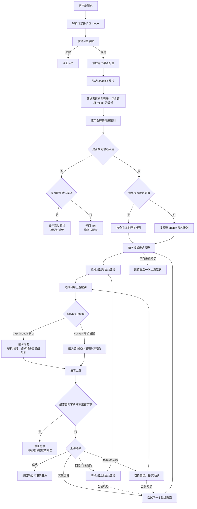
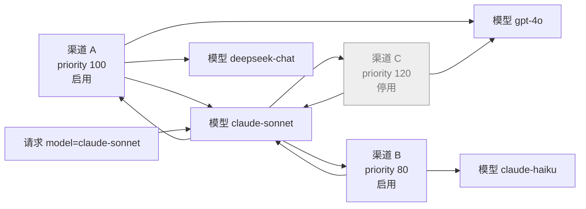

# Keyway 技术方案（DESIGN）

- 版本：v1.8（与 PRD v1.5.4 对应；令牌吊销修复、根路径端点别名、令牌渠道主开关交互、
  AI 配置指令客户端勾选与 Markdown 预览）
- 日期：2026-09-15
- 关联文档：docs/PRD.md
- 本文档解决：架构、技术选型、数据模型落地、核心机制设计、协议转换决策表（PRD 开放
  问题 Q4）、API 设计、部署、测试与实施计划

---

## 1. 总体架构

单进程单二进制，前端静态资源经 go:embed 内嵌，SQLite 落盘，无外部依赖。

```
                         ┌──────────────────────── keyway 进程 ────────────────────────┐
Agent ──HTTPS 443──▶ 反代 ─▶│ gin Router                                               │
(Claude Code/Cline)        │  ├─ /v1/*            relay 层（鉴权→路由→转换→转发→日志） │
                           │  ├─ /api/*           console 层（Web 会话鉴权）           │
                           │  ├─ /oauth/feishu/*  飞书回调                              │
                           │  └─ /healthz                                                     │
                           │                                                            │
                           │  核心服务：                                                  │
                           │  routing   路由/优选/失败切换（内存缓存 + 写失效）            │
                           │  convert   OpenAI ↔ Anthropic 双向转换（含流式）             │
                           │  proxyman  出站代理池（按代理复用连接、字节统计）             │
                           │  probe     线路×路径后台探测器                                 │
                           │  usage     异步日志批写 + 费用快照 + 保留期清理               │
                           │  store     GORM + SQLite(WAL)                                │
                           └────────────────────────────────────────────────────────────┘
                                     │ 直连 / 个人代理 / 公共代理
                                     ▼
                          上游线路 1..n（openai 型 / anthropic 型）
```

关键取舍：

| 决策 | 选择 | 理由 |
|---|---|---|
| 语言 | Go 1.23+ | 单二进制、流式/并发模型成熟、CGO-free 交叉编译 |
| Web 框架 | gin | 生态熟、中间件模型清晰 |
| 存储 | SQLite（glebarez/sqlite，modernc 纯 Go 驱动）+ GORM | 无 CGO，docker 镜像可 distroless；WAL 满足写并发 |
| 前端 | Vite + React + TS + Ant Design 5 | 控制台型 UI 开发效率 |
| 会话 | DB-backed 不透明 token（HttpOnly Cookie） | 服务端可即时吊销（用户禁用即全端下线） |
| 密钥加密 | AES-256-GCM，主密钥来自环境变量 | PRD G4：防拖库 |
| 流式 | 自定义 handler + http.Flusher，不缓冲 | PRD FR-R4 |

## 2. 代码结构

```
keyway/
├── docs/                    # PRD.md / DESIGN.md
├── server/
│   ├── cmd/keyway/main.go
│   └── internal/
│       ├── config/          # 环境变量加载与默认值
│       ├── store/           # GORM 模型、迁移、仓储
│       ├── crypto/          # aesgcm、bcrypt、令牌生成
│       ├── auth/            # 会话、网关令牌查找、飞书 OAuth
│       ├── api/             # /api console 处理器（按资源分文件）
│       ├── relay/           # /v1 入口：openai.go / anthropic.go / models.go
│       ├── convert/         # 转换器（见 §7）+ 金样本测试夹具
│       ├── routing/         # 渠道模型路由、attempt plan、失败切换、缓存失效
│       ├── probe/           # 探测调度器
│       ├── proxyman/        # http.Client 池（按代理 URL）、流量计数
│       ├── usage/           # 异步日志写、价目、聚合查询
│       └── webui/           # go:embed dist
├── web/                     # Vite React 前端源码
├── Dockerfile               # 三阶段：node 构建前端 → go 构建 → distroless
├── docker-compose.yml
└── README.md
```

## 3. 数据模型（最终 DDL）

```sql
CREATE TABLE users (
  id INTEGER PRIMARY KEY,
  username TEXT NOT NULL UNIQUE,
  password_hash TEXT,                      -- 飞书-only 用户为 NULL
  feishu_user_id TEXT UNIQUE,              -- 绑定后非 NULL
  role INTEGER NOT NULL DEFAULT 1,          -- 1 user / 100 admin
  status INTEGER NOT NULL DEFAULT 1,        -- 1 启用 / 2 禁用
  created_at INTEGER, last_login_at INTEGER
);

CREATE TABLE sessions (                    -- Web 会话（DB-backed，可即时吊销）
  token_hash TEXT PRIMARY KEY, user_id INTEGER NOT NULL,
  expires_at INTEGER NOT NULL
);

CREATE TABLE keys (                        -- 上游密钥池
  id INTEGER PRIMARY KEY, user_id INTEGER NOT NULL,
  name TEXT NOT NULL, value_enc BLOB NOT NULL, note TEXT DEFAULT '',
  status INTEGER NOT NULL DEFAULT 1,       -- 1 启用 / 2 禁用
  last_error TEXT, cooldown_until INTEGER DEFAULT 0,
  created_at INTEGER,
  UNIQUE(user_id, name)
);

CREATE TABLE channel_templates (
  id INTEGER PRIMARY KEY, name TEXT NOT NULL,
  type TEXT NOT NULL DEFAULT '',            -- 兼容保留；模板不再配置协议类型，新模板存空串
  base_urls_json TEXT NOT NULL,            -- 线路数组 ≤5
  line_strategy TEXT NOT NULL DEFAULT 'auto',
  models_json TEXT NOT NULL, model_mapping_json TEXT DEFAULT '{}',
  forward_mode TEXT NOT NULL DEFAULT 'passthrough', -- passthrough | convert
  priority_default INTEGER NOT NULL DEFAULT 0,
  allow_public_proxy_default INTEGER NOT NULL DEFAULT 0,
  note TEXT DEFAULT '', enabled INTEGER NOT NULL DEFAULT 1,
  copy_count INTEGER NOT NULL DEFAULT 0, updated_at INTEGER
);

CREATE TABLE channels (
  id INTEGER PRIMARY KEY, user_id INTEGER NOT NULL,
  copied_from_template_id INTEGER,          -- 仅来源标记，不参与路由
  name TEXT NOT NULL,
  type TEXT NOT NULL DEFAULT '',            -- 目标协议，仅 forward_mode=convert 时必填；透明转发存空串
  base_urls_json TEXT NOT NULL,             -- ≤5
  key_ids_json TEXT NOT NULL,               -- ≤5 有序
  key_strategy TEXT NOT NULL DEFAULT 'ordered',  -- ordered|round_robin
  line_strategy TEXT NOT NULL DEFAULT 'auto',
  proxy_url_enc BLOB,                      -- 个人代理（可空）
  allow_public_proxy INTEGER NOT NULL DEFAULT 0,
  models_json TEXT NOT NULL, model_mapping_json TEXT DEFAULT '{}',
  forward_mode TEXT NOT NULL DEFAULT 'passthrough', -- passthrough | convert
  priority INTEGER NOT NULL DEFAULT 0,
  price_multiplier REAL NOT NULL DEFAULT 1,   -- usd 模式折扣倍率
  pricing_mode TEXT NOT NULL DEFAULT 'usd',   -- usd | cny_ratio
  cny_ratio REAL NOT NULL DEFAULT 0,          -- cny_ratio 模式：$1 官方用量实收 ¥X
  is_default INTEGER NOT NULL DEFAULT 0,
  enabled INTEGER NOT NULL DEFAULT 1,
  last_ok_at INTEGER, last_error TEXT, created_at INTEGER
);
CREATE INDEX idx_channels_user ON channels(user_id, enabled);

CREATE TABLE catalog_models (              -- 全局模型目录（管理员预置；点选数据源，不参与路由）
  id INTEGER PRIMARY KEY, name TEXT NOT NULL UNIQUE,
  note TEXT DEFAULT '', enabled INTEGER NOT NULL DEFAULT 1,
  created_at INTEGER, updated_at INTEGER
);

CREATE TABLE line_stats (                  -- 探测结果（渠道×线路×路径）
  channel_id INTEGER NOT NULL, line_url TEXT NOT NULL, via TEXT NOT NULL,
  -- via: direct | personal | proxy:{id}
  last_probe_at INTEGER, latency_ms INTEGER, ok INTEGER, last_error TEXT,
  PRIMARY KEY(channel_id, line_url, via)
);

CREATE TABLE proxies (                      -- 管理员公共代理池
  id INTEGER PRIMARY KEY, name TEXT NOT NULL, url_enc BLOB NOT NULL,
  enabled INTEGER NOT NULL DEFAULT 1, note TEXT DEFAULT '', created_at INTEGER
);

CREATE TABLE proxy_usage (                  -- 公共代理按用户流量（仅统计）
  user_id INTEGER NOT NULL, proxy_id INTEGER NOT NULL, day TEXT NOT NULL,
  bytes INTEGER NOT NULL DEFAULT 0,
  PRIMARY KEY(user_id, proxy_id, day)
);

CREATE TABLE tokens (                      -- 网关令牌
  id INTEGER PRIMARY KEY, user_id INTEGER NOT NULL, name TEXT NOT NULL,
  key_enc BLOB NOT NULL,                   -- 全文加密（支持界面回看）
  key_prefix TEXT NOT NULL,                -- 展示与日志用
  key_hash TEXT NOT NULL UNIQUE,           -- sha256，认证 O(1) 查找
  channel_id INTEGER,                      -- 旧单渠道限定（兼容保留）
  channel_ids_json TEXT DEFAULT '',        -- 多渠道限定集合（空 = 不限，≤20）
  model_scope TEXT,                        -- 模型前缀通配（可空）
  expires_at INTEGER, revoked INTEGER NOT NULL DEFAULT 0, created_at INTEGER
);

CREATE TABLE model_pricing (
  model TEXT PRIMARY KEY,
  input_per_m REAL NOT NULL,
  cached_input_per_m REAL,                -- 缓存读单价（NULL → 回退 input_per_m）
  cache_write_per_m REAL,                 -- 缓存写单价（NULL → 回退 input_per_m；
                                          --   Anthropic 实际 1.25×，价目中显式配置）
  output_per_m REAL NOT NULL,
  currency TEXT NOT NULL DEFAULT 'USD', updated_at INTEGER
);

CREATE TABLE logs (
  id INTEGER PRIMARY KEY, created_at INTEGER NOT NULL,
  user_id INTEGER NOT NULL, token_id INTEGER, channel_id INTEGER,
  template_source_id INTEGER,             -- 复制来源模板（可空，仅统计）
  line_url TEXT, via TEXT, key_id INTEGER,
  protocol TEXT,                           -- openai|anthropic（入站）
  model TEXT, upstream_model TEXT, status_code INTEGER,
  ttft_ms INTEGER, total_ms INTEGER,
  prompt_tokens INTEGER, completion_tokens INTEGER,
  cached_tokens INTEGER,                   -- 缓存读 token（归一化）
  cache_write_tokens INTEGER,              -- 缓存写 token（归一化，anthropic 专有）
  input_cost REAL, output_cost REAL,       -- 写入时快照；未定价为 NULL
  error TEXT                               -- 截断 512B
);
CREATE INDEX idx_logs_time ON logs(created_at);
CREATE INDEX idx_logs_user ON logs(user_id, created_at);
CREATE INDEX idx_logs_channel ON logs(channel_id, created_at);
CREATE INDEX idx_logs_key ON logs(key_id, created_at);

CREATE TABLE invite_codes (
  code TEXT PRIMARY KEY, created_by INTEGER, used_by INTEGER, used_at INTEGER
);

CREATE TABLE settings (key TEXT PRIMARY KEY, value TEXT);
```

迁移：启动时 GORM AutoMigrate + 内置价目表种子数据（常见模型默认价，含主流供应商
缓存读/写价，随版本更新）。

## 4. 认证与安全设计

### 4.1 Web 会话

- 登录成功 → 生成 32B 随机 token，sha256 存 sessions 表，原文置 HttpOnly+Secure+
  SameSite=Strict Cookie，默认有效期 7 天
- 每请求查 sessions（带过期清理）；用户被禁用 → 删除其全部 sessions（下一个请求即 401）
- CSRF：SameSite=Strict + 自定义头 `X-Keyway-CSRF`（前端每次携带，服务端强校验）；
  JSON-only API 不接受表单编码

### 4.2 网关令牌（/v1 鉴权）

- 格式：`sk-keyway-` + 43 字符 base62（32B 随机）
- 认证：`Authorization: Bearer` 或 `x-api-key` 取原文 → sha256 → tokens.key_hash 唯一索引
  命中（内存缓存，LRU 1000，写失效）→ 校验 revoked/expires/用户 status/可选
  channel 与 model_scope
- 令牌吊销/用户禁用：缓存写失效，下一个请求生效（满足 FR-T4/A10）

### 4.3 加密方案

- 主密钥：环境变量 `KEYWAY_SECRET`（32B，base64/hex；缺失时启动报错并提示生成命令）
- 密文格式：`AES-256-GCM(key=HKDF(KEYWAY_SECRET, purpose), nonce=12B random)`
  ‖ `nonce` 前置存储；每次保存重新随机 nonce（同值多次加密密文不同）
- 覆盖对象：keys.value_enc、tokens.key_enc、channels.proxy_url_enc、proxies.url_enc
- 界面回看：网关令牌支持（用户自己的）；上游密钥与代理 URL 编辑时留空=不变、填新值=覆盖。
  令牌详情回看接口仅允许所属用户调用，要求当前会话、CSRF 和二次确认；管理员 API 永不返回
  明文。创建响应可展示一次完整密钥，之后按同一回看流程取值。
- 管理员界面永不返回任何 *_enc 解密结果（API 层无该字段输出路径）

## 5. 路由与转发引擎

### 5.1 路由解析（FR-R1 / FR-MD）

```
resolve(model, user, token) → []RouteCandidate
  1. 按 user_id + name 查启用模型
  2. 查绑定该模型的启用渠道，并过滤 channel.enabled=1 与 token.channel_ids
  3. 排序：token 限定渠道集合非空 → 按令牌绑定顺序（令牌级优先级，令牌页拖拽控制）；
     否则按 channel.priority 降序，稳定顺序作为平局规则
  4. 每个候选携带 channel.type（仅 convert 使用）、channel_id、channel.forward_mode 和上游模型名
  5. 为空且存在 is_default 渠道 → [default_channel]（模型名透传）
  6. 仍为空 → 404（错误契约见 PRD 7.3）
```

实现：每用户渠道模型列表和渠道状态缓存于 `sync.Map[userID]→snapshot`，模型列表/渠道 CRUD
后使该用户快照失效（单实例内完成，保证 FR-R7 即时生效）。`GET /v1/models` 从同一快照去重
模型名，仅返回至少有一个启用渠道的模型。

路由流程：



渠道与模型是“一个渠道绑定多个模型”的关系；同一模型可以被多个渠道绑定：



请求 `claude-sonnet` 时，停用的渠道 C 会先被过滤；渠道 A 优先于渠道 B。渠道 A 在首字节
前失败，才切换到渠道 B。透明转发模式不会执行协议转换，只有渠道高级设置启用 `convert`
时才按渠道协议类型转换请求和响应。

### 5.2 尝试计划与失败切换（FR-K5 / FR-S3 / FR-R2）

对每个候选渠道生成有序组合序列 `(line, path, key)`：

1. 线路排序：line_stats 中 `ok=1` 且延迟最低者优先；探测数据过期（>3 周期）视为未知，
   按 base_urls 录入顺序；`line_strategy=manual` 时固定第一条线路且不做路径优选
2. 路径展开：直连 → 个人代理（如配）→ 启用的公共代理（如 allow_public_proxy=1，
   按代理池顺序，参与探测矩阵的 ≤4 条）
3. 密钥选择：ordered → 首个未冷却密钥；round_robin → 原子计数取模（跳过冷却者）
4. 错误分类驱动下一跳：
   - 连接失败 / TLS 错误 / 拨号超时 → **换路径/线路**（同 key）
   - 401 / 403 / 429 → **换密钥**（同线路）；429 时对该 key 设冷却 =
     `Retry-After` 头（缺省 `KEYWAY_KEY_COOLDOWN_DEFAULT=60s`）
   - 5xx 及其他 4xx → 换下一组合（先线路后渠道）
5. 预算：单请求最多 3 个组合（环境变量可调）；组合耗尽 → 换下一候选渠道；
   全部渠道耗尽 → 透传最后一次上游错误（保留状态码与 body）
6. **首字节保护**：一旦向客户端写出任何字节（含流式首包），不再做任何切换，错误透传

### 5.3 转发管线

```
入站请求
 ├ MaxBytesReader(50MB)
 ├ 解析 protocol（按路径）+ 提取 model
 ├ 令牌鉴权 → user
 ├ resolve → channel 列表 → attempt plan
 ├ 逐组合执行：
 │   ├ convert.In{openai|anthropic} → channel.type 对应出站结构
 │   ├ http.Client（按 path 从 proxyman 取，连接池复用）
 │   ├ 拨号/TLS 超时 10s（渠道可覆盖）；响应头超时 60s
 │   ├ 流式：SSE 逐块转换写出（http.Flusher，无缓冲）
 │   └ 非流式：读全 body 转换写出
 ├ usage 抽取：openai 取最后 chunk usage / anthropic 取 message_delta.usage
 └ 异步投递日志（见 §8）
```

### 5.4 出站代理管理（proxyman）

- `map[proxyURL]*http.Client`：http/https 用 `http.ProxyURL`；socks5 由 net/http
  原生支持（`socks5://` scheme 的 Transport.Proxy）
- 每客户端独立 Transport 与连接池（MaxIdleConnsPerHost=32，IdleConnTimeout=90s）
- 公共代理字节统计：包装 `http.ResponseWriter` 不适用（上游方向），改为在 Dial 处
  无法计数——**落点**：对经公共代理的响应 Body 包一层 `countingReader`，
  累计到内存 `map[(user,proxy,day)]bytes`，每 30s 批量 UPSERT proxy_usage（仅公共代理）
- 直连与个人代理不计流量（PRD 仅要求公共代理统计）

## 6. 探测器（probe）

- 单 goroutine 调度：每 30s 扫描到期渠道（`now ≥ next_probe_at`），带 ±20% jitter
  防同步风暴；探测失败连续 ≥3 次 → 频率×2 指数退避，上限 60 分钟；成功恢复基准频率
- 每渠道探测矩阵：线路（≤5）× 路径（直连+个人+公共 ≤4）= ≤20 组合，
  每组合发最小请求：openai 型 `POST /chat/completions {model, max_tokens:8,
  messages:[{role:user,content:"ping"}]}`；anthropic 型同理（max_tokens:8）
- 探测使用该渠道当前首选可用密钥（会消耗极少量上游额度，文档明示；矩阵上限×频率
  约束见 PRD 非功能需求）
- 结果 UPSERT line_stats（latency_ms / ok / last_error / last_probe_at）
- 管理员"立即探测"与用户"测试渠道"按钮走同一矩阵，实时返回结果矩阵
- 探测不产生 logs 记录（PRD FR-S6）

## 7. 协议转换（PRD 开放问题 Q4 决策表）

四个方向：`OI→AO`（openai 入→openai 出，透传）、`OI→AN`、`AI→AN`（透传）、`AI→OI`。
透传 = 仅改写鉴权头（+模型映射）后原样转发；转换 = 解析重建。

`forward_mode=passthrough` 是默认路径：网关保留入站协议和报文结构，仅替换线路、鉴权信息
和必要的模型映射。只有渠道高级设置选择 `convert` 时，才使用 `channels.type` 选择跨协议
转换器；`channels.type` 仅在该模式下必填（其余存储为空，对路由无影响）。模型列表属于渠道
基础配置，协议类型不出现在模型管理页和预制模板页。

### 7.1 请求字段映射（OI→AN）

| OpenAI 入站 | Anthropic 出站 | 决策 |
|---|---|---|
| messages[].role=system（含 content parts） | 顶层 system（文本拼接） | ✅ 完整支持 |
| messages[].role=user/assistant 文本 | messages 同角色 text 块 | ✅ |
| content[].type=image_url（http(s) 或 data:base64） | image 块：url source / base64 source（media_type 从 data URI 解析） | ✅ |
| assistant.tool_calls[] | assistant content 的 tool_use 块（arguments JSON string→object） | ✅ |
| role=tool {tool_call_id, content} | user 消息内 tool_result 块 | ✅ |
| 连续同角色消息（openai 允许） | 合并为单条（anthropic 要求 user/assistant 交替） | ✅ 合并 |
| max_tokens / max_completion_tokens | max_tokens | 缺省填 `DEFAULT_MAX_TOKENS=8192`（anthropic 必填） |
| temperature / top_p | 同名 | ✅ |
| stop → stop_sequences | | ✅ |
| tools[].function{name,description,parameters} | tools[]{name,description,input_schema} | ✅ |
| tool_choice auto/none/required/{function} | {type: auto/none/any/tool,name} | ✅ |
| stream_options.include_usage | （anthropic 流式总是带 usage） | 忽略 |
| n>1 | — | ❌ 400 明确报错（单选一限制） |
| response_format（json_schema 等） | — | ❌ v1 丢弃并在响应头 `X-Keyway-Dropped` 标记 + debug 日志；结构化输出场景请用同协议渠道 |
| reasoning_effort / top_k / logit_bias / presence_penalty / frequency_penalty | — | ❌ 丢弃（X-Keyway-Dropped 列出） |
| user | metadata.user_id | ✅ |

### 7.2 请求字段映射（AI→OI，Claude Code → openai 型渠道）

| Anthropic 入站 | OpenAI 出站 | 决策 |
|---|---|---|
| system（string 或 blocks） | messages[0] system 文本 | ✅ |
| messages[].content 文本/图片块 | user content（图片→image_url） | ✅ |
| user 内 tool_result 块 | role=tool {tool_call_id} | ✅ |
| assistant 内 tool_use 块 | assistant.tool_calls[]（input→arguments JSON string） | ✅ |
| assistant 内 thinking 块 | — | ❌ **丢弃**（历史思考不回传上游；记 debug） |
| cache_control（任意字段上） | — | ❌ 剥离（记 debug，每请求一次） |
| max_tokens | max_tokens | ✅ |
| stop_sequences → stop；temperature/top_p 同名 | | ✅ |
| tools / tool_choice | 反向同 7.1 | ✅ |
| anthropic-version 等专有头 | 剥离 | ✅ |
| metadata.user_id → user | | ✅ |

### 7.3 响应与流式映射

**非流式 AN→OI**：content 文本块拼接为 message.content；tool_use → tool_calls[]
（input→arguments string）；thinking 块 → 非标准字段 `reasoning_content`（DeepSeek
惯例，下游 Agent 普遍识别）；stop_reason 映射 end_turn→stop、max_tokens→length、
tool_use→tool_calls；usage input/output→prompt/completion。

**非流式 OI→AN**：反向；上游若带 `reasoning_content`（DeepSeek reasoner 等）→ thinking 块。

**流式 AN→OI（SSE）**：

| Anthropic 事件 | OpenAI chunk |
|---|---|
| message_start | 首 chunk（role=assistant，usage.prompt_tokens） |
| content_block_start(text) | （无输出，等待 delta） |
| content_block_delta(text_delta) | choices[0].delta.content |
| content_block_start(tool_use) | delta.tool_calls[i]={id,type,function.name} |
| content_block_delta(input_json_delta) | delta.tool_calls[i].function.arguments 追加 |
| content_block_delta(thinking_delta) | delta.reasoning_content |
| message_delta(stop_reason, usage) | finish_reason 映射 + usage chunk |
| message_stop / ping | [DONE] / 忽略 |

**流式 OI→AN（SSE）**：反向合成 message_start / content_block_start / content_block_delta /
message_delta / message_stop 事件序列（含 event id 与递增序号，符合 anthropic wire 格式）；
`delta.reasoning_content` → thinking 块；`delta.tool_calls` 增量 → input_json_delta。

**usage 抽取**（透传/转换通用）：openai 流式取末尾 usage chunk（建议上游开启
include_usage；无则 tokens 记 NULL）；anthropic 流式取 message_delta.usage。缓存字段
（cached_tokens / cache_write_tokens）按 §8.2.1 归一化。

**count_tokens（AI 侧）**：本地估算 `Σ ceil(text_chars/3.6)`，响应格式符合 anthropic；
文档明示为近似值。

### 7.4 错误转换

- 同协议（OI→AO、AI→AN）：上游状态码 + body 原样透传
- 跨协议：状态码保留，body 转换为目标协议错误结构（openai `{error:{message,type,code}}`
  ↔ anthropic `{type:"error",error:{type,message}}`），message 保留上游原文

### 7.5 金样本测试（关键质量闸门）

`server/internal/convert/testdata/` 维护成对夹具：openai↔anthropic 的请求/响应/流式
SSE 序列（含工具调用多轮、图片、thinking、usage 各场景，来源为真实抓包脱敏）。
CI 强制双向 round-trip 一致后才允许合入。参考实现对齐 claude-code-router /
new-api 的已知语义（仅参考行为，代码自研）。

## 8. 用量、费用与统计

### 8.1 异步日志

- relay 完成（或失败）后组装 log 结构投递 `chan Log`（容量 4096）
- 单 goroutine 批写：满 200 条或 1s 刷盘；队列满则丢弃并计数告警（保护主路径，
  宁缺日志不断流）
- 失败请求也记录（status_code + error）

### 8.2 费用快照（FR-L5，含缓存计价与渠道计价模式）

- 写日志时查 model_pricing（内存缓存，编辑后失效）：`upstream_model`（映射后）优先，
  回退入站 model
- 基础公式（token 归一化后，官方 USD 价）：
  ```
  base_input  = (prompt_tokens − cached_tokens − cache_write_tokens) ÷ 1M × input_per_m
              + cached_tokens      ÷ 1M × cached_input_per_m
              + cache_write_tokens ÷ 1M × cache_write_per_m
  base_output = completion_tokens ÷ 1M × output_per_m
  ```
- 渠道计价模式（v0.9）：
  - `pricing_mode = usd`（默认）：`cost = base × price_multiplier`（美元渠道折扣）
  - `pricing_mode = cny_ratio`：`cost = base × cny_ratio ÷ usd_cny_rate`
    （人民币渠道：$1 官方用量实收 ¥cny_ratio，如 micu 渠道 0.5 表示 $1 → ¥0.5；
    汇率 `settings.usd_cny_rate` 默认 7.2，管理员可改）
- 缓存档回退：`cached_input_per_m` 为 NULL → 取 `input_per_m`；`cache_write_per_m`
  为 NULL → 取 `input_per_m`（Anthropic 实际 1.25×，在价目中显式配置）
- 未命中价目 → 费用 NULL；统计页区分"已定价/未定价"两档展示
- 耗时指标（v1.0）：`ttft_ms`（请求开始到首个写出块）、`total_ms` 随日志落库

### 8.2.1 usage 与缓存 token 归一化（转换/透传通用）

| 上游类型 | 字段 | 归一化 |
|---|---|---|
| openai 型 | usage.prompt_tokens | prompt_tokens（**已含**缓存部分） |
| openai 型 | usage.prompt_tokens_details.cached_tokens（DeepSeek 旧版：prompt_cache_hit_tokens） | cached_tokens |
| openai 型 | （无缓存写字段） | cache_write_tokens = 0 |
| anthropic 型 | usage.input_tokens | 与 cache_read/cache_creation **三段互斥**，归一化 prompt_tokens = 三段之和 |
| anthropic 型 | usage.cache_read_input_tokens | cached_tokens |
| anthropic 型 | usage.cache_creation_input_tokens | cache_write_tokens |

流式抽取位置不变（openai 末尾 usage chunk / anthropic message_delta.usage），同一
归一化函数 `normalizeUsage()` 处理（convert 包导出，relay 层与转换层共用，金样本覆盖）。

### 8.3 聚合查询

- 用户页/管理员页均直接 `GROUP BY` logs（30 天 × ≤百用户 ≈ 10^6 行，命中索引足够）
- 维度：user / model / channel / key / 天；管理员追加全员与公共代理流量（proxy_usage）
- 最近生效流量（`stats.latest`）：`ORDER BY id DESC LIMIT 1` 取该用户最新一条成功
  （status_code < 400 且 channel_id 非空）日志，回传渠道名/模型/时间；不受 days 窗口限制，
  API 层按 channel_id 补渠道名
- CSV：服务端流式生成 `text/csv` 下载
- 若 v1.1 出现慢查询 → 增加 daily rollup 表（计划内，不在 MVP）

### 8.4 模型目录与渠道模型列表维护

- 全局模型目录 `catalog_models`（管理员维护，可从价目表一键导入）：仅作为渠道/模板表单的
  点选数据源与用户模型页的目录视图，**不参与路由**；删除目录项不影响已引用它的渠道配置。
- 渠道表单的模型候选 = 目录（启用项）∪ 用户已有模型（各渠道 models_json 并集，去重），
  目录外名称仍可自由输入（自定义中转模型名）。
- 用户模型页「我的模型」= 各渠道 `models_json` 并集；重命名/删除走
  `PUT /api/models/bindings`，事务内同时更新所选渠道的 `models_json` 和
  `model_mapping_json`（重命名顺带迁移映射）。
- 不创建用户级模型实体；空绑定模型不会出现在路由与 `/v1/models` 中。渠道表单和模型管理页
  共享同一数据来源，避免两套配置产生分歧。

## 9. 预制渠道复制（FR-X2/X3）

- `POST /api/channels/from_template/:id`：读模板 → 预填渠道字段（密钥留空、
  allow_public_proxy 取模板默认值、priority 取 priority_default）→ 返回草稿 ID
  （status=draft，不参与路由）→ 用户编辑绑定 key 后 `PUT /api/channels/:id` 转正式
- 复制即自增模板 copy_count；channels.copied_from_template_id 仅作来源标记
- "源模板已更新"提示：渠道列表接口联查 `templates.updated_at > channel.created_at`
  的来源标记，前端展示徽标（无自动行为）
- 模板删除：无级联（channels.copied_from_template_id 保留为悬挂标记，提示自然消失）

## 10. 飞书 OAuth（FR-A5）

```
GET /api/auth/feishu/url
  → https://open.feishu.cn/open-apis/authen/v1/authorize?app_id&redirect_uri&state
GET /oauth/feishu/callback?code&state
  1. POST /open-apis/auth/v3/app_access_token/internal  (app_id, app_secret)
  2. POST /open-apis/authen/v2/oauth/token              (code → user_access_token)
  3. GET  /open-apis/authen/v1/user_info                 (→ open_id, name)
  4. users.feishu_user_id 命中 → 建会话；未命中且注册开放 → 自动建号绑定；
     否则拒绝并提示
```

- app_id/app_secret 存 settings（secret 加密存储），管理员配置页含回调地址展示
- state 用带签名的随机数防 CSRF（HMAC + 5 分钟有效期）
- 飞书登录关闭：按钮隐藏，已绑定用户密码登录不受影响（无密码的飞书-only 用户由
  管理员重置密码）

## 11. API 设计

### 11.1 控制台 `/api`（会话鉴权 + CSRF 头）

| 方法与路径 | 说明 |
|---|---|
| POST /api/auth/register /login /logout | 注册 / 登录 / 退出 |
| GET /api/auth/me；PUT /api/auth/password | 当前用户 / 改密 |
| GET /api/auth/feishu/url；PUT /api/auth/feishu/bind | 登录跳转 / 绑定解绑 |
| GET/POST/PUT/DELETE /api/keys[/:id] | 密钥池 CRUD |
| PUT /api/keys/:id/status | 密钥启用/停用（停用后不参与渠道轮换） |
| GET/POST/PUT/DELETE /api/channels[/:id] | 渠道 CRUD |
| GET /api/channels | 读取渠道及其模型列表（模型管理页数据源） |
| GET /api/models/catalog | 全局模型目录（启用项，用户点选数据源，只读） |
| PUT /api/models/bindings | 原子批量加入、移出或重命名渠道模型 |
| POST /api/channels/from_template/:tid | 从模板复制（草稿） |
| POST /api/channels/:id/test；POST /api/channels/:id/test_keys | 矩阵测试 / 逐密钥测试 |
| GET /api/templates | 模板列表（用户侧，含复制数） |
| GET/POST/PUT/DELETE /api/tokens[/:id] | 令牌 CRUD（列表仅返回前缀） |
| PUT /api/tokens/:id | 更新令牌（名称 / 限定渠道集合，集合顺序即令牌级路由优先级） |
| POST /api/tokens/:id/reveal | 所属用户回看完整令牌（复制密钥按钮数据源） |
| GET /api/logs | 自己的日志（分页/过滤） |
| GET /api/stats | 自己的统计（含最近生效流量 latest） |
| 管理员（AdminAuth）：/api/admin/users、/api/admin/settings、/api/admin/models
  （模型目录 CRUD + import_pricing 一键导入）、/api/admin/templates、
  /api/admin/proxies、/api/admin/pricing(+import)、/api/admin/stats、/api/admin/invites | 见 PRD §5.9 |

### 11.2 中转 `/v1`（令牌鉴权）

按 PRD §7.1：`/v1/chat/completions`、`/v1/completions`、`/v1/embeddings`、`/v1/models`
（OpenAI+Anthropic 双格式）、`/v1/messages`、`/v1/messages/count_tokens`。
全部端点在根路径注册等价别名（`registerRelay` 同时挂 `/v1` 组与根组），客户端 base_url
带不带 `/v1` 均可；静态资源经 `r.NoRoute` 兜底，与根路径别名无冲突。

## 12. 配置项（环境变量）

| 变量 | 默认 | 说明 |
|---|---|---|
| KEYWAY_SECRET | （必填） | 主密钥 32B，base64/hex |
| KEYWAY_DATA_DIR | ./data | SQLite 与数据目录 |
| KEYWAY_PORT | 8080 | 监听端口 |
| KEYWAY_BASE_URL | 空 | 对外地址（OAuth 回调/链接展示） |
| KEYWAY_PROBE_INTERVAL_MIN | 10 | 探测周期（分钟） |
| KEYWAY_ATTEMPT_BUDGET | 3 | 单请求组合尝试上限 |
| KEYWAY_KEY_COOLDOWN_S | 60 | 429 默认冷却 |
| KEYWAY_DEFAULT_MAX_TOKENS | 8192 | OI→AN 缺省 max_tokens |
| KEYWAY_BODY_LIMIT_MB | 50 | 请求体上限 |
| KEYWAY_IDLE_STREAM_TIMEOUT_S | 300 | 流式空闲超时 |
| KEYWAY_LOG_RETENTION_DAYS | 30 | 日志保留期 |

## 13. 部署

- **Dockerfile 三阶段**：`node:20` 构建 web → `golang:1.23`（CGO_ENABLED=0）构建 →
  `gcr.io/distroless/static`（只含二进制+内嵌前端，暴露 8080，/data 卷，HEALTHCHECK
  /healthz）
- **docker-compose**：单服务 + volume `./data:/data` + 关键环境变量样例
- **反代样例**（README 提供 nginx 配置）：443 TLS、`proxy_buffering off`、
  `proxy_read_timeout 3600s`、支持 chunked——流式必需
- 升级 = 换镜像 tag 重启（自动迁移）；备份 = 停机拷贝 `./data/keyway.db`

## 14. 测试方案

| 层 | 内容 |
|---|---|
| 单元 | convert 金样本 round-trip（§7.5）；错误分类器；attempt plan 排序；AES-GCM/bcrypt |
| 集成 | httptest 模拟上游矩阵：透传/转换、流式分块边界、失败切换链（网络→换线、429→换 key+冷却、预算耗尽→换渠道→502 透传）、首字节保护 |
| 端到端 | 本地起 keyway + mock 上游，真实 Claude Code（ANTHROPIC_BASE_URL 指向）跑工具调用多轮；Cline 会话内切模型；mihomo socks5 做公共代理打通假"墙外"上游 |
| 探测 | 虚拟延迟注入验证优选排序与退避 |
| 压力 | 50 并发流式 10 分钟（PRD A7）；日志批写在高压下的丢弃行为 |

## 15. 实施计划（里程碑）

| 阶段 | 内容 | 验收（PRD） | 状态 |
|---|---|---|---|
| M1 骨架 | 项目脚手架、配置、DB 迁移、用户/会话/注册、渠道与密钥池 CRUD、令牌签发、透传转发（同协议）+ 流式、异步日志 | A1 A2 A5(部分) A6 A8 A10 | ✅ |
| M2 协议转换 | 双向转换器 + 流式事件映射 + 金样本回归、count_tokens、/v1/models 双格式 | A4 | ✅ |
| M3 优选与切换 | 探测器、line_stats、attempt plan、失败切换、key 轮换冷却、测试按钮 | A9 A11 A15 A16 | ✅ |
| M4 代理与模板 | proxyman（个人+公共池）、流量统计、预制模板 CRUD+草稿复制 | A3 A12 A17 A18 | ✅ |
| M5 观测 | 价目表（CRUD/导入导出）、费用快照（计价模式/汇率）、统计页、CSV、管理员用户管理 | A14 | ✅ |
| M6 准入与收尾 | 飞书 OAuth、邀请码、保留期清理、docker 化、README | A13 | ✅ |
| 迭代 | 渠道计价模式、令牌多渠道绑定、耗时指标（A7 压测除外均完成） | — | ✅ |

每阶段完成标准：对应验收项自测通过 + 单元/金样本测试全绿 + gofmt/go vet 干净。
（A7 压测未执行，属运维验证项，部署后按需进行。）

## 16. 风险与对策

| 风险 | 对策 |
|---|---|
| 协议转换长尾字段导致 Agent 行为异常 | §7 决策表冻结 v1 范围；被丢弃字段经 `X-Keyway-Dropped` 响应头暴露；金样本回归持续覆盖 |
| SQLite 写竞争（日志高峰） | WAL + 批量写 + 队列丢弃策略（保转发不保日志）；v1.1 rollup |
| 探测消耗上游额度或触发风控 | 矩阵上限、jitter、失败退避、文档明示、渠道可 manual 关闭探测 |
| 流式内存增长 | 全链路无缓冲透传；仅 usage 抽取按块处理；压测验证 |
| 飞书自建应用不可得 | 密码登录并存；OIDC 列 v2 |
| 单实例故障 | docker restart + 数据落盘；备份规程写入 README |
