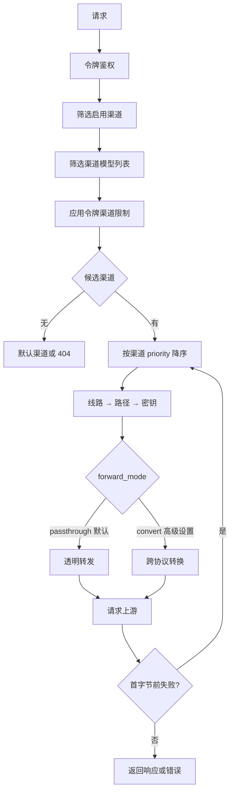

# Keyway 需求文档（PRD）

- 版本：v1.5.23
- 日期：2026-09-15
- 状态：M1–M6 全部实现并部署；文档与实现同步
- 定位：自托管、多租户、纯转发的 AI API 网关。每个用户自带上游 key（BYOK），获得一个
  统一且永久不变的 OpenAI/Anthropic 兼容端点。

> 变更记录：
> - v1.5.23：探测**模型回退与错误摘要**（oct-micu-vip2/oct-yescode 案例修正）——
> ① 探测此前固定用渠道第一个模型，而中转站常见"部分模型分组无渠道/provider 路由
> 不命中"（new_api `model_not_found`、team 网关 "no enabled provider"），导致可用
> 渠道被整体误判失败；现按渠道模型列表前 3 个依序回退尝试，任一模型成功即该
> "线路 × 路径"组合健康；② 探测失败信息此前只报状态码（"上游返回 503"），现解析
> 上游错误响应体的 `error.message`（openai/anthropic/new_api 通用结构，截断 120
> 字符）拼入错误摘要，失败时按模型 × 协议逐条汇报，"为什么不过"一目了然；
> ③ 整个组合的模型 × 协议回退共享 15s 总超时，探测上限不因回退而放大
> - v1.5.22：渠道测试按钮两处修正——① **假失败**：探测协议此前按渠道 `type` 判定，
>   而透明转发渠道 `type` 恒为空，导致 Anthropic 上游渠道"明明能用但测试失败"；且
>   探测未应用模型映射，映射渠道会因上游模型名不存在而失败。现探测与真实转发完全
>   一致：模型名先经映射，convert 渠道用显式目标协议，passthrough 渠道按模型名族
>   推断首选协议（`claude*` → anthropic，其余 → openai）并**失败时回退另一协议**
>   再试（兼容 claude 模型走 openai 兼容中转等场景），全部失败汇报各协议错误摘要；
>   ② **即时反馈**：探测矩阵由串行改为**并发**（此前最坏 20 组合 × 15s 超时 ≈ 5
>   分钟无响应），前端点击"测试"立即打开结果弹窗并显示探测中状态，按钮进入
>   loading，关闭弹窗丢弃过期响应；逐密钥测试同样并发化
> - v1.5.21：限定渠道面板三处体验修正——① **开关不再引起弹层位移**：面板内操作
>   改为乐观更新 + 用接口返回的令牌静默更新对应行（不再触发列表 loading 整表刷新），
>   且胶囊入口宽度固定，摘要文本变化不再引起表格列宽重排（弹层锚点稳定）；
>   ② **消除拖拽/点击误触**：HTML5 拖拽的 dragstart 目标是行本身，无法在子控件上
>   拦截，改为按下开关/↑↓ 时标记抑制、起拖时取消——点击交互控件微动不再触发行拖拽；
>   ③ 开关响应即时化（乐观更新 + 去掉整表刷新卡顿），保存失败自动回滚到操作前状态
> - v1.5.20：模型目录**新增支持从价目表搜索点选**——"新增模型"弹窗的模型名改为
>   自动完成输入框：输入关键字即在价目表（近 3000 条）中本地筛选，候选项右侧显示
>   输入/输出价摘要（虚拟滚动，无分页压力）；已收录条目不出现在候选中；选中后
>   表单下方显示四档价目关联预览；目录外名称仍可自由输入。替代 v1.5.18 撤销的
>   批量"从价目表导入"——单条精挑收录，目录不再被淹没
> - v1.5.19：流式保活、止损与 usage 兜底——① 流式响应每 15s 发送 SSE 注释 ping 保活
>   （防反代/CDN 空闲断连）；② `KEYWAY_IDLE_STREAM_TIMEOUT_S`（默认 300s，0 关闭）
>   流式空闲超时**接线**（DESIGN 规划项落地：上游持续无数据即关上游止损；**修订
>   v1.5.12"不做流式空闲超时"的决策**——保活 ping 下仅切断上游真正无输出的连接）；
>   ③ 客户端断开立即关闭上游连接止损；④ openai 透传流式注入
>   `stream_options.include_usage`（不再依赖客户端默认携带）；⑤ usage 兜底估算：
>   上游未回传 usage 时按请求文本与累计流式增量本地估算（口径同 count_tokens，
>   Σ ceil(runes/3.6)），仅补 0 值字段不覆盖真实值；⑥ ComputeCost 改用价目
>   快照批量查询（多档价目一次性载入）
> - v1.5.18：模型目录与价格展示修正——① **撤销"从价目表导入"功能**（含 API
>   `POST /api/admin/models/import_pricing` 与管理页按钮）：价目表经远程同步后体量庞大
>   （近 3000 条），一键导入会把目录淹没，而用户只关心自己用到的常用模型；目录回归
>   管理员手动收录常用模型的定位（v1.5 引入的该功能移除）；② 价格展示优化：新增
>   `fmtPrice` 数字格式化（4 位有效数字去尾零），价目表四档价格列**右对齐 + 等宽数字**，
>   模型目录单价改为"标签 + $ 数值"两行展示（输入/输出、缓存读/缓存写），缓存档
>   未配置时**直接显示回退生效数值**，不再出现"同输入 / 按输入计价"类文字
> - v1.5.17：令牌限定渠道**顺序与启用集合分离**（取代 v1.5.15 的会话级记忆方案）——
>   新增 `channel_order_json` 持久化面板全量顺序（含已关闭渠道，纯 UI，路由不读），
>   `channel_ids_json` 继续作为路由范围。面板中**关闭的渠道保持原位**（置灰显示，
>   只是移出路由范围），顺序不变、跨会话不丢；重新打开即恢复路由且优先级不变；
>   主开关关闭时顺序保留，重开恢复上次配置的渠道与顺序；`PUT /api/tokens/:id`
>   新增 `channelOrder` 字段，`tokenDTO` 回显 `channelOrder`
> - v1.5.16：统计页四处修正——① 按渠道/按密钥分组维度显示**渠道名与密钥名**（已删除的
>   回退 `#id`）；② "（部分未定价）"判定修正：写入时未定价（费用 NULL）的成功请求在统计
>   查询时按**当前价目**补算并计入汇总与分组费用，仅当前价目仍缺失的模型才标记未定价
>   （快照语义仅覆盖已定价行，价目补齐后统计随之完整，不再长期残留"部分未定价"）；
>   ③ 统计时间窗支持**自定义起止日期**（`start`/`end` 参数 + 日期范围选择，保留今天/
>   昨天/近 7 天/近 30 天快捷项与刷新按钮，`days` 参数向后兼容）；④ 最近生效流量从
>   1 条扩展为**最近 5 条**（`stats.recent` 列表，展示时间/渠道/模型/状态）
> - v1.5.15：令牌「限定渠道」面板交互优化——① 列表入口从纯文本链接改为**胶囊按钮**
>   （边框 + 展开箭头 + hover 反馈，明确可点击展开）；② 排序支持**整行拖拽**（按指针
>   在行内上/下半区计算插入位置，末行下半区即落末尾，落点指示不再挤压布局）并新增
>   **↑↓ 按钮**逐位微调；③ 修复**开关导致优先级变化**：移出的渠道重新加入时按记忆
>   位置原位恢复；主开关关闭后重开恢复上次的集合与顺序而非重置全选（会话级记忆，
>   仅存内存，从未配置过才默认全选）
> - v1.5.14：① 汇率来源**展示同步信息地址**——同步时随 `usd_cny_rate_source` 一并落库
>   命中源的实际请求地址 `usd_cny_rate_source_url`（manual 固定值为空）；设置页"当前
>   汇率"区块在来源 Tag 下方以链接形式展示该地址（可跳转核对），`GET /api/admin/settings`
>   回显 `exchangeRateSourceUrl`，`POST /api/admin/exchange-rate/sync` 返回 `sourceUrl`；
>   ② 价目表与模型目录体验增强——模型目录（用户页与管理员页）单价列直接显示**完整
>   四档价**（主行输入/输出，副行缓存读/写，未配置标注回退输入价，无同名条目显示
>   "未定价"）；管理页价目表**目录条目置前显示**（带"目录"标签）并支持**按模型名搜索
>   筛选**；价目表展示**远程同步元信息**：最近一次官方价目同步时间
>   （`settings.pricing_synced_at`，至少单源成功才记录）与同步源链接
>   （LiteLLM / OpenRouter，`GET /api/admin/pricing` 一并返回 syncedAt + sources）
> - v1.5.13：模型目录与价目表的关联可视化——① 模型目录（用户页与管理员页）新增
>   "单价（$/百万 tokens）"列：按**模型名精确匹配** model_pricing（与费用计算同口径），
>   无同名条目显示"未定价"；② 价目表缓存读/写列不再显示"（同输入价）"占位，直接显示
>   生效数值（未配置时按输入价回退的值以浅色 + Tooltip 标注）
> - v1.5.12：上游响应头等待超时对齐 new-api——从固定 60s 改为
>   `KEYWAY_RESPONSE_HEADER_TIMEOUT_S`（默认 1800s，0=不限制）；非流式长推理的
>   响应头可能远超 60s，60s 会误杀。同时修正文档：FR-R4 的"流式空闲超时 300s"
>   从未实现，对齐 new-api 决策明确**不做**流式阶段整体/空闲超时（会切断合法
>   长流式），依赖客户端断开取消
> - v1.5.11：汇率 `usd_cny_rate` 支持**自动同步**——新增 `fxrate` 后台任务（启动 30s 后
>   首跑、此后每 24h 从公共汇率源拉取 USD→CNY，frankfurter → jsdelivr CDN →
>   open.er-api 三源顺序回退，值域 0.5~20 之外视为源异常继续回退）；管理员设置页
>   提供 `auto`（定时同步）/ `manual`（固定值）模式切换，auto 下展示当前值、来源与
>   更新时间并提供「立即同步」按钮，manual 下保留原固定值输入并新增「获取最新」
>   （预览不落库，确认后保存）；新增 `POST /api/admin/exchange-rate/sync`
>   （apply=true 写入生效 / false 仅预览）；`KEYWAY_FX_SOURCE_URL` 可覆盖为单一自建
>   汇率源（无回退，测试/镜像场景）；缺省模式 manual，与存量部署行为完全兼容
> - v1.5.10：模型价目**远程同步**——新增 LiteLLM
>   （`model_prices_and_context_window.json`）与 OpenRouter（`/api/v1/models`）双数据源，
>   归一化为 USD/百万 token（含缓存读/写档），**只补缺不覆盖**已有条目（人工维护优先，
>   如需刷新可删除后重同步）；定期同步 `KEYWAY_PRICING_SYNC_HOURS`（默认 24 小时，0 关闭，
>   启动时先执行一次）；管理页价目表新增"同步官方价目"手动按钮（幂等，单源失败降级为
>   警告）。同时补齐 28240ee 中 main.go 已引用的 pricing 包与配置字段
> - v1.5.9：修复内网部署下复制在 Firefox / 部分内嵌浏览器中失败（提示「剪贴板不可用」）：
>   根因是 `await` 网络请求（取令牌明文、模型列表）之后再复制，已脱离用户手势的同步
>   调用栈，execCommand 回退被静默拒绝。① 接入指南「让 AI 帮你配置」与令牌页「复制密钥」
>   改为**预取复制材料**（选中令牌/指针按下时获取明文与模型列表，仅存 ref 不渲染），
>   点击时在手势内同步执行剪贴板写入；② `copyText` 回退增强：textarea `readonly`、
>   Range 选区 + `setSelectionRange`（iOS 兼容）、原有选区恢复、Clipboard API 失焦重试
> - v1.5.8：**新增 `/v1/responses` 端点（OpenAI Responses API 透传）**，Codex 等默认走
>   Responses 协议的客户端可直连，无需配置 `wire_api="chat"`；仅 openai 型渠道承接
>   （passthrough 及 convert→openai），失败切换与 chat 管线同策略，流式逐块回写，
>   usage 从 `response.completed` 事件嗅探。排查该问题时一并修复三处：
>   ① 未注册端点的 POST 请求原先落入前端 SPA 回退返回 200 + index.html（客户端
>   表现为"无响应"且无限重试），现改为 404 JSON（GET 保留 SPA 回退供前端路由）；
>   ② 上游端点统一拼 `/v1` 前缀（原先 openai 型拼 `/chat/completions`、`/responses`
>   漏掉 `/v1`，多数标准站端点在 /v1 之下；base_url 已以 /v1 结尾不重复拼）；
>   ③ 上游 2xx 却返回 text/html（网关型站点对未知路径的 SPA 回退）不再当成功透传，
>   转发换下一组合、探测记为不健康
> - v1.5.7：撤销 v1.5.6 的"同步到价目表"按钮（改为运维直接按官网价维护价目表）；
>   本次已按官网价格补齐生产价目：GLM-5.2/5.3/5.3-Flash（智谱官方 ¥8/¥28 等，
>   按汇率 7.2 折 USD）、deepseek-v4.1-flash（DeepSeek 官方峰值 $0.3/$1.2）、
>   claude-sonnet-4-6（Anthropic 官方 $3/$15，缓存 $0.3/$3.75；补入目录）
> - v1.5.6：① 复制统一走 `copyText` 工具（Clipboard API 失败回退 execCommand），
>   http/内网环境「复制密钥」不再弹窗；② 令牌支持**删除记录**（`DELETE /api/tokens/:id`，
>   吊销改 `POST /:id/revoke`；吊销保留记录可回看，删除移除记录且令牌自然失效）；
>   ③ 模型目录新增**「同步到价目表」**（目录中未定价的模型以 0 价占位写入 model_pricing，
>   已有价目不受影响，幂等），作为价目表的初始内容来源
> - v1.5.5：交互去重与内联化——① 接入指南「让 AI 帮你配置」移除重复的剪贴板回退弹窗，
>   合并进指令预览（复制失败时自动展开预览并展示真实指令 + 重试复制；平时令牌脱敏）；
>   ② 令牌渠道配置从行首展开改为**「限定渠道」列内弹出**（Popover 直接展示主开关、
>   渠道开关与拖拽排序），列表不再有展开列
> - v1.5.4：① **修复令牌吊销失效**（handleRevokeToken 的 GORM 更新缺少 Model，SQL 未
>   命中 tokens 表，返回 404"令牌不存在"）；② 令牌渠道交互重构：展开行增加"限定渠道
>   范围"主开关（关闭=不限，打开默认全选后自行移出）、拖拽改为手柄触发并增加落点指示、
>   列表"限定渠道"列改为摘要 + Tooltip 顺序展示；③ **网关端点兼容 /v1 与不带 /v1**
>   （/chat/completions、/completions、/embeddings、/models、/messages、
>   /messages/count_tokens 在根路径注册等价别名，客户端 base_url 带不带 /v1 均可）；
>   ④ AI 配置指令支持**勾选目标客户端**（指令仅包含所选客户端任务），并渲染 Markdown
>   预览（令牌脱敏，复制时为真实值）
> - v1.5.3：接入指南调整——① 各客户端**优先推荐把密钥直接写进配置文件**
>   （Claude Code settings.json / Codex `experimental_bearer_token` / opencode `apiKey`，
>   内网场景泄露风险可控；环境变量降级为临时方案）；② opencode 优先推荐
>   `@ai-sdk/openai` 与 `@ai-sdk/anthropic`（`@ai-sdk/openai-compatible` 为备选）；
>   ③ 新增**「让 AI 帮你配置」**卡片：选择令牌后一键复制完整配置指令（含令牌明文、
>   网关地址与该令牌可路由的模型列表），粘贴给任意 AI 工具即可代为修改配置
> - v1.5.2：新增控制台**接入指南**页（/guide）——按客户端（Claude Code / Codex / opencode /
>   通用 OpenAI 兼容）给出可复制的配置示例（自动填充当前网关地址），引导"渠道 → 令牌 →
>   客户端"三步接入；令牌创建成功弹窗增加指南入口；README 同步扩充 Agent 配置章节
> - v1.5.1：渠道启用可达性修复——"启用"开关从折叠的高级选项移至表单主区（草稿编辑时
>   可见，避免绑定密钥保存后仍处于停用）；渠道列表操作列支持一键启用/停用；未绑密钥的
>   停用渠道显示"草稿"标识；模板复制提示补充"启用"步骤
> - v1.5：模型体系重构——① 新增**全局模型目录**（管理员预置 `catalog_models`，支持从
>   价目表一键导入），作为渠道/模板表单的点选数据源；② 渠道表单模型列表改为**点选**
>   （目录 ∪ 已有模型，目录外名称仍可自由输入）；③ 模型管理页重构为「我的模型」（模型名
>   管理：重命名/删除 + 服务渠道展示）+「模型目录」（只读）两个视图，渠道关联（路由依据）
>   统一在渠道表单中维护
> - v1.4：控制台交互修正——① 密钥页支持**启用/停用**（停用后不参与渠道轮换）；
>   ② 渠道协议类型仅在跨协议转换（convert）时才需要选择，透明转发为默认且不出现该选项；
>   ③ 模型管理页改为**模型为中心**（只管理模型目录与渠道绑定，不再展示渠道属性）；
>   ④ 预制模板（用户页与管理员页）不再显示协议类型；⑤ 令牌页操作列直接提供**复制密钥**，
>   展开行可点选开关控制渠道并**拖动调整令牌内优先级**（绑定顺序即路由顺序）；
>   ⑥ 统计页显示**最近生效流量**（最新成功请求命中的渠道与模型）
> - v1.3：完成模型批量绑定页、令牌回看、渠道转发模式设置；默认透明转发，跨协议转换须显式开启
> - v1.2：① 明确一个渠道可绑定多个模型，统一模型页仅作为批量编辑入口；② 默认透明转发，跨协议转换移入渠道高级设置；③ 模型列表保留在渠道基础配置
> - v1.1：① 新增统一模型管理页；模型在渠道配置中维护，可批量把一个模型加入多个渠道并按渠道优先级路由；②
>   明确渠道独立启用开关与优先级的控制台交互；③ 网关令牌支持所有者主动回看完整密钥（管理员仍不可见）；④
>   补充协议类型仅用于出站适配，不参与逻辑模型管理的说明与验收标准
> - v1.0：整体 review——① 修复渠道更新（不改代理时）静默丢弃计价字段；② 耗时指标落地
>   （TtftMs/TotalMs 随日志落库，日志页可见）；③ 跨协议错误体仅在跨协议失败时转换
>   （同协议保持原文）；④ line_stats 新鲜度阈值读取探测周期配置；文档全面同步实现
> - v0.9：① **令牌多渠道绑定**（channelIds，≤20）：令牌限定一组渠道，配合渠道级启用开关实现
>   "按需开关"；旧单渠道字段兼容保留；② 渠道计价模式（pricing_mode）：`usd`（美元渠道倍率折扣）
>   / `cny_ratio`（人民币渠道：$1 官方用量实收 ¥X，如 micu 渠道 0.5 表示 $1 → ¥0.5），
>   统计统一按全局汇率 `usd_cny_rate`（默认 7.2，管理员可改）折算 USD
> - v0.8：① 渠道**价格倍率**（price_multiplier，默认 1）——渠道优惠场景（如中转 5 折填 0.5），
>   作用于费用统计快照，不影响上游真实计费；② 预制渠道复制改为**无密钥草稿**（enabled=0
>   不参与路由），用户绑定密钥后启用，不再自动绑第一把密钥；③ 内置价目更新为 2026-09
>   官方页实时抓取（OpenAI/Anthropic/DeepSeek/Kimi；GLM 官网 JS 渲染无法抓取保留近似值）
> - v0.7：费用估算**纳入缓存计价**——价目表增加缓存读/写单价；日志记录归一化的缓存
>   token 数；费用公式区分普通/缓存读/缓存写三档输入价
> - v0.6：项目定名 **Keyway**（原名 byok-gateway）；网关令牌前缀改为 `sk-keyway-`；
>   技术方案定稿（docs/DESIGN.md），其中解决了开放问题 Q4（协议转换决策表）
> - v0.5：预制渠道交互模型改为**复制式**——模板不直接进入用户渠道，用户点击"复制"生成
>   独立的自定义渠道草稿后自行修改保存；保存后与模板完全解耦，模板更新不影响已复制渠道
>   （仅轻量提示）。删除 v0.4 的派生/实时下发/快照脱离机制及相关开放问题
> - v0.4：新增预制渠道（管理员模板）；共享配置不共享密钥
> - v0.3：公共代理仅按用户统计流量（决策）；上游密钥池（多 key 组合、轮换、冷却、分账）；
>   术语澄清；OIDC 说明并保留 v2
> - v0.2：否决共享密钥渠道；注册默认开放+飞书登录；多线路+线路×路径自动优选；
>   公共代理池 opt-in；管理员用量/花费统计+价目表
> - v0.1：初稿

---

## 1. 背景与痛点

使用者是一群在本地跑 AI 编程 Agent（Claude Code、Cline 等）的人，现状痛点：

| # | 痛点 | 根因 |
|---|------|------|
| P1 | 本地切换供应商/密钥需要改环境变量并**重启 Agent** | Agent 的上游配置（baseURL + key）写死在本地配置里 |
| P2 | 访问部分上游**需要走代理**，代理还时有时无 | 本地直连不可达（OpenAI/Anthropic 等），或上游本身在受限网络侧 |
| P3 | **本地环境受限** | 公司/受限机器无法安装常驻服务、无法配置复杂客户端，只能用标准 HTTPS 出站 |
| P4 | 同一供应商常有**多个接入线路**（官方 + 各种中转域名），哪个快/哪个通要手动试 | 线路质量动态变化，本地无法自动探测 |
| P5 | 手里同一个供应商常有**多个账号/多把 key**，且同一把 key 想以不同姿势（不同线路、不同模型集）使用 | key 和端点耦合在渠道配置里，无法自由组合 |
| P6 | 新成员接入门槛高：不知道哪些线路通、要配什么代理、模型叫什么 | 这些"环境知识"散落在每个老成员的本地配置里 |
| P7 | 模型名需要在多个渠道重复输入；新增一个模型要逐个打开渠道维护，容易漏配或拼写不一致 | 缺少用户级模型目录与统一绑定界面 |

现有产品错位：one-api/new-api 系的渠道是管理员资源，用户无法自助管理自己的上游；
LiteLLM、Kong、Higress 同样是管理员配置；OpenRouter BYOK 满足需求但是托管 SaaS。
"多租户 + 用户自管渠道 + 统一端点 + 纯转发"的自托管产品是空白，本项目补这个空白。

## 2. 产品定位

一句话：**Agent 只配置一次网关地址和网关令牌；之后一切切换、线路优选、密钥轮换都在服务端完成、即时生效。**

服务端只做五件事：

1. 多租户：用户注册登录，各自管理自己的上游密钥、上游渠道与网关令牌，互相完全隔离
2. 转发：把请求按模型名路由到该用户自己的某个渠道，默认透明转发；跨协议转换为高级设置
3. 线路/代理/密钥优选：渠道可配多线路，网关持续探测"线路 × 出站路径"组合自动择优；
   渠道可组合多把上游密钥，限流/失效自动轮换
4. 用量可观测：按用户/模型/渠道/密钥统计请求数、token 数、费用估算
5. 预制渠道：管理员把线路/代理/模型等"环境知识"沉淀为模板，用户**复制**一份、贴上
   自己的 key、按需修改即用

不做计费收费、不做额度管控、不做共享密钥——"纯管道 + 可观测"。

## 3. 目标与非目标

### 3.1 目标（v1）

- G1 免重启切换：Agent 端一次性配置；供应商、密钥、模型映射的变更在 Web 端保存后，
  **下一个请求即生效**
- G2 网络解耦：网关部署在可达服务器上；受限上游经出站代理访问
- G3 本地零依赖：客户端只需要能发标准 HTTPS 的 OpenAI/Anthropic 协议请求
- G4 安全隔离：用户间渠道/密钥不可见；上游密钥与网关令牌落库加密
- G5 轻量：单容器、单二进制、SQLite，内存占用 < 512MB
- G6 线路自愈：同一渠道多线路 + 多出站路径，探测择优；故障自动降级，用户无感（见 5.10）
- G7 便捷准入：注册默认开放；支持飞书扫码一键登录/注册
- G8 密钥组合：上游密钥独立成池，渠道按需组合多把，同 key 可复用于多渠道；
  429/失效自动换 key，多账号额度可分账统计（见 5.2）
- G9 预制渠道：管理员模板共享**配置**不共享**密钥**；用户一键复制、贴 key、可改任何
  字段；复制后完全独立（见 5.4）
- G10 模型集中管理：统一模型页维护模型清单；每个渠道可绑定多个模型，支持从统一页面批量
  将模型加入或移出多个渠道，并按渠道设置启用状态和优先级

### 3.2 非目标（已决策）

- 管理员提供**共享密钥**的渠道（"站长 key 大家用"）——不做，v2 也不做；
  管理员可配**预制渠道模板**（复制源，密钥用户自配）——v1 范围（见 5.4）
- 计费、充值、额度、倍率、兑换码（无任何商业模式；费用仅作统计估算）
- 图像/视频/音乐等非文本模态（MJ、Suno 等）
- 多实例横向扩展（v1 单实例 + SQLite）
- OpenAI /v1/responses 的跨协议**转换**（透传已支持，见 7.1；转换入 v2）、Gemini 原生协议
- 对话内容存储与分析（隐私，见日志设计）

## 4. 角色与核心场景

### 4.1 角色

- **普通用户（租户）**：注册/飞书登录后自建密钥池、自建渠道（可从预制模板复制）、
  自签网关令牌、看自己的用量与花费
- **管理员（部署者）**：除普通用户能力外，管理注册策略、用户开关、**公共代理池**、
  **模型价目表**、**预制渠道模板**，查看全员用量/花费统计；**不能**查看用户上游密钥
  与网关令牌明文

### 4.2 核心用户故事

US1 一次性配置
> 作为 Agent 用户，我配置一次 `ANTHROPIC_BASE_URL`（或 OpenAI 兼容 baseURL）指向网关，
> key 填网关签发的 `sk-keyway-...`，之后再也不改本地任何东西。

US2 服务端切换供应商（P1）
> 我想从官方 Anthropic 切到某中转站：网页上把 `claude-*` 模型的路由从渠道 A 改到渠道 B，
> 保存，下一条消息就走 B，Claude Code 不重启。

US3 会话内按模型切换（P1）
> 我的多个渠道声明了不同模型名；Agent 会话内直接换模型名（/model 或下拉框），
> 网关按模型名路由，同样无需重启。

US4 代理出站（P2）
> 某渠道上游在墙外：我在该渠道上允许使用公共代理（或配置自己的 `socks5://...`），
> 网关所在服务器即可访问；其他渠道不受影响。

US5 受限本地环境（P3）
> 我在公司电脑上只能访问 443：网关挂在标准 443 域名后面，Agent 正常工作，本地零安装。

US6 多线路自动优选（P4）
> 我的渠道配了 3 个 base_url（官方 + 两个中转）。网关持续探测，自动走当前最快且通的
> 那条；某条挂了自动换下一条，我什么都不用做。网页上能看到每条线路的实时延迟。

US7 排障
> 请求 500 了：我打开日志页看到命中渠道、线路、密钥、上游状态码、耗时、错误摘要，
> 并用"测试渠道"按钮对全部 线路×路径 组合做一次探测；对多 key 渠道可"逐密钥测试"。

US8 多密钥组合与轮换（P5）
> 我有某供应商的 3 个账号 key：渠道 C1 绑 key1+key2（官方线路），渠道 C2 绑 key2
> （中转线路、另一套模型名）。key1 被 429 后网关自动用 key2 完成，key1 冷却；
> 我的统计页能看到每个账号各自用了多少。

US9 多租户隔离
> 我和朋友共用这套部署：他完全看不到我的渠道和密钥，我也看不到他的。

US10 飞书登录
> 我不想记密码：管理员开了飞书登录后，登录页点"飞书登录"扫码，首次自动建号，
> 之后一键进入。

US11 用量与花费
> 管理员想知道这个月谁用了多少、花了多少：统计页按用户/模型/天展示请求数、token、
> 费用估算，可导出 CSV。我自己也能看到自己的同款视图。

US12 预制渠道复制（P6）
> 我是新成员：管理员配好了"OpenAI 官方（3 条线路，建议公共代理）"预制模板。我在
> 预制渠道列表点"复制到我的渠道"，改个名字、从密钥池绑上我的 key，保存即用——
> 线路、代理、模型清单这些环境知识都来自模板，我不用摸索。之后我随时可以按自己
> 的想法改任何字段，改完就是我自己的配置，跟模板再无关联。

US13 统一管理模型（P7）
> 管理员提前在"模型目录"里维护好常用模型；我建渠道时直接从目录点选（目录外的名字也能
> 手动输入），不用逐个拼写。"模型"页能看到我已有的模型分别由哪些渠道服务；想统一改名
> （如 `claude-sonnet-4` → `claude-sonnet-4.5`）在模型页重命名一次即可，所有渠道与映射
> 同步更新。停用某个渠道后它立即不参与该模型路由，恢复后按原优先级自动生效。

## 5. 功能需求

### 5.1 账户与认证

- FR-A1 用户名 + 密码注册登录；密码 bcrypt 存储；会话用 HttpOnly Cookie + CSRF 防护
- FR-A2 注册策略：**默认开放注册**；管理员可切换为邀请码制或关闭
- FR-A3 飞书登录（FR-A5）与密码体系并存；用户可绑定/解绑飞书
- FR-A4 管理员可禁用/启用/删除用户；禁用后该用户全部网关令牌**立即失效**；
  用户可自行改密码，忘记密码由管理员重置
- FR-A5 飞书 OAuth 登录：
  - 管理员在系统设置配置飞书自建应用的 App ID / App Secret
  - 登录页展示"飞书登录"；标准 OAuth2 授权码流程，回调 `/oauth/feishu/callback`
  - 首次授权且当前注册策略为开放 → 自动注册并绑定 `feishu_user_id`
  - 注册策略为邀请码/关闭时，仅已绑定用户可登录，新用户拒绝并提示
  - 授权范围仅取用户身份，不申请通讯录等敏感权限

### 5.2 上游密钥池（多 key）

上游密钥 = 用户持有的供应商 API key，是独立于渠道的用户级资源。

- FR-K1 密钥池：每用户可建 ≤ 30 个上游密钥（名称 + 密文值 + 备注）；界面不回显明文
- FR-K2 渠道组合：渠道绑定 1~5 个密钥（有序列表）；**同一密钥可被多个渠道复用**
- FR-K3 选择策略（渠道级）：`ordered`（默认，取首个可用，失败换下一个）/
  `round_robin`（请求间轮换，均摊多账号额度）
- FR-K4 换 key 时机：上游返回 401/403/429 且**尚未向客户端写出首字节** → 同线路换
  下一密钥重试；429 按响应 `Retry-After`（缺省 60s）为该密钥设置冷却，冷却期内
  不再首选
- FR-K5 失败语义叠加（与线路/渠道降级协作）：
  - 网络类错误（连接失败/超时）→ 换线路/路径（FR-S3）
  - 鉴权/限流类（401/403/429）→ 换密钥（FR-K4）
  - 单请求组合尝试上限 3 次，仍失败 → 换渠道（FR-R2），再失败透传最后错误
- FR-K6 密钥状态：每密钥记录最近错误、冷却到期时间；渠道详情页可见，支持"逐密钥测试"
- FR-K7 用量分账：日志记录命中密钥；用户统计页支持按密钥聚合请求数/token/费用
  （多账号额度跟踪）
- FR-K8 启用/停用：密钥页可随时停用某把密钥（status=2），停用后不参与任何渠道的密钥
  轮换与路由；重新启用后恢复。配置保留，不影响渠道绑定关系

### 5.3 渠道管理（核心）

渠道 = 用户的一个上游配置 = **线路集合 × 密钥集合 × 模型服务声明**。用户渠道均为
**自有且全字段可编辑**，来源可以是空白新建，也可以从预制模板复制（复制后与模板解耦，
见 5.4）。字段：

| 字段 | 说明 |
|---|---|
| name | 展示名 |
| type | **仅跨协议转换（forward_mode=convert）时需要选择**的目标协议：`openai` / `anthropic`；透明转发（默认）不出现该选项，存储为空 |
| base_urls[] | **1~5 条线路**，按优先顺序录入；网关按优选策略在健康线路中选择 |
| key_ids[] | **1~5 个上游密钥**（有序），来自密钥池；可复用同一密钥 |
| key_strategy | `ordered`（默认）/ `round_robin` |
| line_strategy | `auto`（默认，探测择优）/ `manual`（固定第一条线路，行为可预期） |
| proxy_url | 可选**个人**出站代理（http/socks5，可带认证），加密存储 |
| allow_public_proxy | 是否使用公共代理参与优选；复制模板时取模板默认值，空白新建默认关 |
| models[] | 该渠道声明服务的模型名列表；属于基础配置，可一键从上游拉取 |
| model_mapping | 可选映射：请求模型名 → 上游模型名（精确匹配，未命中则透传原名） |
| forward_mode | `passthrough`（默认透明转发）/ `convert`（高级设置，启用跨协议转换） |
| priority | 同一模型命中多渠道时的优选顺序（数值大优先） |
| pricing_mode | 计价模式（费用统计用）：`usd`（美元渠道，倍率折扣）/ `cny_ratio`（人民币渠道，$1 官方用量实收 ¥X） |
| price_multiplier | `usd` 模式折扣倍率（默认 1，如 8 折填 0.8） |
| cny_ratio | `cny_ratio` 模式换算比（如 0.5 表示 $1 → ¥0.5；统计按全局汇率 `usd_cny_rate` 折 USD） |
| enabled / status | 开关；停用（草稿）允许 0 密钥保存，启用须绑定 1~5 把 |

- FR-C1 渠道 CRUD 全部由用户自助完成，仅作用于本人；所有字段可随时修改，保存后
  下一个请求生效
- FR-C2 测试按钮：对该渠道全部"线路 × 路径"组合各发一条 `max_tokens=8` 的最小对话
  （用当前首选密钥，**并发**探测全部组合），汇报每个组合的连通性与耗时；点击后立即
  打开结果弹窗进入探测中状态，无需等待返回；探测与真实转发一致：请求模型名先经
  渠道模型映射得到上游模型名，convert 渠道用其显式目标协议，passthrough 渠道按模型
  名族推断首选协议（`claude*` → anthropic，其余 → openai）并在失败时回退另一协议
  再试（兼容 claude 模型走 openai 兼容中转等场景）；模型同样支持回退——渠道模型
  列表前 3 个依序尝试，任一成功即组合健康（应对中转站部分模型分组无渠道/provider
  不命中的情况）；整个组合的回退共享 15s 总超时；失败信息包含上游错误响应体的
  `error.message` 摘要（截断 120 字符），按模型 × 协议逐条汇报；另支持"逐密钥测试"
  （见 FR-K6，同样并发执行、同样回退与摘要规则）
- FR-C3 默认渠道：用户可指定一个兜底渠道，模型名未命中任何渠道时走它并透传模型名；
  未设置时返回 404 错误并提示（见 7.3）
- FR-C4 渠道独立控制：渠道编辑表单（"启用渠道"开关位于表单主区）与渠道列表操作列均可
  单独切换 `enabled`；停用渠道不参与任何模型路由、`/v1/models` 聚合和失败切换，已有配置
  保留，重新启用后恢复。渠道 `priority` 在渠道页调整，保存后下一个请求生效。模板复制出
  的草稿（未启用且未绑密钥）在列表中显示"草稿"标识。

### 5.3.1 模型目录与模型管理

模型名是路由键：请求按 `model` 字段筛选渠道，因此**"渠道 ↔ 模型"的关联关系是路由依据，
不可省略**；该关系在渠道表单中以点选方式维护。模型管理页只负责模型目录本身，不承载渠道
配置。

**全局模型目录（管理员预置）**：`catalog_models` 表（名称 + 备注 + 启用开关），管理员
手动收录常用模型（用户只关心自己用到的模型，不与价目表对齐）。目录是点选数据源，
不是路由依据——仅出现在渠道/模板表单的候选列表与用户模型页的目录视图中；删除目录项
不影响已引用它的渠道配置。

- FR-MC1 目录管理（管理员）：模型目录 CRUD（名称、备注、启用）；新增弹窗支持**从价目表
  搜索点选**（本地筛选 + 价格摘要与选中预览，替代批量导入）；停用的目录项不再出现
  在用户点选项中。价目表内容由管理员/运维按官方价格维护（无自动同步）
- FR-MC2 目录可见性（用户）：启用中的目录模型对所有登录用户只读可见（名称、备注、
  是否已在自己渠道中使用、**关联单价**——按模型名精确匹配 model_pricing，与费用计算
  同口径；直接显示完整四档价（输入/输出、缓存读/缓存写两行，缓存档未配置时直接显示
  回退生效数值），无条目显示"未定价"）
- FR-MD1 模型页「我的模型」视图：展示用户所有渠道的模型并集及其服务渠道（只读信息）；
  支持重命名（同步更新所有渠道及模型映射）与删除（从所有渠道移除）
- FR-MD2 渠道表单的模型列表为**点选**：候选 = 全局目录 ∪ 用户已有模型（去重）；目录外
  的名称仍可自由输入回车添加（自定义中转模型名场景）
- FR-MD3 每个渠道模型绑定可设置上游模型名映射（默认等于请求模型名）；渠道 `enabled`
  和模型绑定状态同时生效，任一关闭即不参与路由，但不删除配置。
- FR-MD4 同一模型命中多个渠道时按渠道 `priority` 降序选择（令牌限定渠道时按令牌绑定
  顺序）；优先级和渠道开关在渠道页修改，保存后下一个请求生效。
- FR-MD5 模型管理页不要求用户填写协议类型；协议适配属于渠道的高级设置（见 FR-R3）。

### 5.4 预制渠道（管理员模板，复制式）

预制渠道 = 管理员配置的**模板**，用于沉淀线路、代理建议、模型清单等环境知识；
**模板不含任何密钥**。用户点击"复制"生成属于自己的独立渠道，此后与模板完全解耦。

- FR-X1 模板管理（管理员）：CRUD；字段与渠道一致（base_urls、line_strategy、
  models、model_mapping、priority 默认值、allow_public_proxy 默认值）+ 展示名、
  说明、启用开关；可整体停用/删除。模板**不配置协议类型**：复制出的渠道默认透明转发，
  需要跨协议转换时在渠道高级设置中自行开启。模板表单的模型列表同样从全局模型目录点选
- FR-X2 一键复制：用户在预制渠道列表点"复制到我的渠道"→ 生成渠道编辑草稿（线路、
  模型、代理建议、priority 等字段全部预填，密钥留空）→ 用户绑定密钥、按需修改任意
  字段后保存。保存后即为普通自有渠道
- FR-X3 复制即解耦：模板的后续更新**不影响**已复制出的渠道；渠道仅记录
  `copied_from_template_id` 作为来源标记，当源模板有更新时渠道列表显示轻量提示
  （"源模板已更新，可重新复制"），纯提示、无任何自动行为
- FR-X4 密钥边界：模板中无密钥字段；复制出的渠道上的密钥仅用户本人可见
- FR-X5 模板可见性：启用中的模板对所有登录用户可见（含线路、模型等完整配置，
  本就无机密信息）；停用的模板从列表隐藏
- FR-X6 模板观测（管理员）：每模板可见复制次数；统计看板可按"复制来源模板"聚合
  用量（尽力而为，渠道删除后链路自然断开）

### 5.5 网关令牌（签发给 Agent）

- FR-T1 每用户可签发多个 `sk-keyway-` 前缀令牌；界面可查看、吊销
- FR-T2 令牌可选：**限定渠道集合（多选 ≤20，配合渠道启用开关按需切换路由）**、
  限定模型（前缀通配）、过期时间
- FR-T2.1 令牌列表的"限定渠道"列以**胶囊按钮**呈现摘要（边框 + 展开箭头 + hover 反馈），
  点击**就地弹出渠道配置面板**（Popover）：面板内以**"限定渠道范围"主开关**控制——
  关闭 = 不限（路由到所有启用渠道，按渠道优先级；面板顺序保留，重开即恢复上次配置的
  渠道与顺序）；打开 = 恢复已配置的顺序，从未配置过才默认全选（按渠道优先级排序）。
  面板内渠道按**配置顺序**整列显示（数据模型：`channel_order_json` 存全量顺序，
  `channel_ids_json` 存启用集合，二者分离）；**关闭的渠道保持原位**（置灰显示，仅移出
  路由范围，顺序不变、跨会话持久），重新打开即恢复路由且优先级不变；未加入的渠道
  （虚线行）打开开关后追加到列表末尾。渠道**整行可拖拽**（按指针在行内上/下半区计算
  插入位置，末行下半区即落末尾，带落点指示）或用 **↑↓ 按钮**逐位调整顺序（绑定顺序即
  该令牌的路由优先级，自上而下依次尝试），与全局渠道优先级独立、互不影响其他令牌；
  全部关闭后回到不限状态（顺序仍保留）。面板内操作**乐观更新**并以接口返回结果
  **静默更新对应行**（不触发列表 loading 整表刷新，弹层不随刷新位移；胶囊入口宽度
  固定，摘要变化不引起列宽重排）；点击开关/↑↓ 时**抑制行拖拽**（按下标记 +
  dragstart 取消），不会误触排序；保存失败回滚到操作前状态。列摘要显示前两个渠道名
  + 总数；已吊销令牌仅显示摘要不可配置
- FR-T3 认证时同时接受 `Authorization: Bearer` 与 `x-api-key`（兼容两类客户端习惯）
- FR-T4 令牌吊销立即生效（`POST /api/tokens/:id/revoke`，保留记录可回看）；已吊销令牌可
  **删除记录**（`DELETE /api/tokens/:id`，记录移除后令牌自然失效，不可恢复）
- FR-T5 创建令牌时在成功响应中展示完整密钥；之后用户可在令牌列表直接点击**复制密钥**
  一键复制完整值（指针按下时预取明文，点击时在用户手势内同步执行剪贴板写入，兼容
  http/内网与 Firefox 等严格校验手势的浏览器）。仅令牌所有者可执行，管理员和其他
  用户永远只能看到前缀；回看不改变密钥，吊销后不可用于请求。
- FR-T6 接入指南页（/guide）：按客户端给出可复制的配置示例——Claude Code
  （`~/.claude/settings.json` 的 env 块，**优先直接写密钥**；环境变量为临时方案）、
  Codex（`~/.codex/config.toml`，默认 Responses 协议 `/v1/responses` 直连，
  `wire_api="chat"` 为 chat 协议备选，均无需额外适配；优先 `experimental_bearer_token`
  直写密钥，公网可改 `env_key`）、opencode（opencode.json，优先
  `@ai-sdk/openai` / `@ai-sdk/anthropic` 双 provider 共用令牌，
  `@ai-sdk/openai-compatible` 为备选）、通用 OpenAI 兼容（Base URL + curl 验证）。
  示例自动填充当前网关地址（页面 origin，生产自行替换域名），并以三步引导
  （渠道 → 令牌 → 客户端）说明前置条件；令牌创建成功弹窗提供指南入口
- FR-T6.1 让 AI 帮你配置：指南页提供令牌选择器 + **目标客户端勾选**（Claude Code /
  Codex / opencode，至少一项）+ 一键复制配置指令；指令包含网关地址、所选令牌完整明文、
  该令牌可路由的模型列表（明文与模型在**选中令牌时预取**、仅存内存不渲染，点击复制时
  在用户手势内同步执行剪贴板写入，规避浏览器手势校验失败）与**所选客户端**的改配任务
  说明，粘贴给任意 AI 工具即可代为修改配置文件。卡片内提供 **Markdown 渲染的指令预览**
  （单一预览区：平时令牌脱敏，复制成功后提示；剪贴板不可用时自动展开预览、展示真实指令
  并提供"重试复制"）。指令含敏感明文，页面明确提示仅粘贴给信任的 AI 工具

### 5.6 路由与转发

- FR-R1 路由规则：取请求体 `model` → 在该用户启用模型及其启用绑定中筛选启用渠道 → 按
  绑定优先级（未设置时继承渠道 priority）降序取候选；**令牌限定了渠道集合时，候选改按
  令牌绑定顺序排列（见 FR-T2.1）**；未限定时按渠道 priority 降序。命中多个同优先级时按
  稳定顺序轮询。每个候选绑定携带独立的上游模型名，转发时使用该名称。令牌的渠道限制再与
  候选集合取交集。
- FR-R2 失败切换（渠道维度）：同模型次优先级渠道，仅当**尚未向客户端写出首字节**时
  允许重试；流式已开始则原样透传错误。线路维度见 FR-S3，密钥维度见 FR-K4/FR-K5
- FR-R3 转发模式与协议转换：
  - 默认 `forward_mode=passthrough`：同协议透明转发，仅改写鉴权、线路和必要的模型映射
  - 高级设置 `forward_mode=convert`：允许跨 OpenAI/Anthropic 协议转换
  - 转换模式下：
    - 入站 OpenAI（/v1/chat/completions）→ 出站 openai 型：透传改写鉴权
    - 入站 OpenAI → 出站 anthropic 型：完整转换（含流式 SSE 事件、工具调用）
    - 入站 Anthropic（/v1/messages）→ 出站 anthropic 型：透传改写鉴权
    - 入站 Anthropic → 出站 openai 型：完整转换（含 tool use 双向往返、流式增量、thinking/reasoning 映射）
- FR-R4 流式：逐字节透传不缓冲；**不设整体超时**（Client.Timeout 式会切断合法长流式）；
  流式期间每 15s 向客户端发送 SSE 注释 ping 保活，上游持续无数据超过
  `KEYWAY_IDLE_STREAM_TIMEOUT_S`（默认 300s，0 关闭）关闭上游止损；客户端断开
  立即关闭上游（v1.5.19 修订：v1.5.12 曾决策不做流式空闲超时，保活 ping 落地后
  空闲超时仅切断上游真正无输出的连接）
- FR-R5 超时：连接上游（拨号/TLS）10s 默认，可按渠道覆盖；上游响应头等待
  `KEYWAY_RESPONSE_HEADER_TIMEOUT_S` 默认 1800s（0=不限制）——非流式长推理的
  响应头可能远超 60s，默认值对齐 new-api `RELAY_RESPONSE_HEADER_TIMEOUT`
- FR-R6 请求体上限默认 50MB（长上下文+图片 base64）
- FR-R7 **即时生效**：渠道/路由/令牌变更后下一个请求生效（进程内缓存写失效，
  单实例内保证）
- FR-R8 `GET /v1/models` 返回该用户所有启用渠道模型名的并集（OpenAI 与 Anthropic 两种
  响应格式），供 Agent 界面列出可选模型
- FR-R9 `/v1/models` 返回所有启用渠道模型名的并集；同一模型只返回一次，
  不暴露渠道密钥或内部优先级。模型请求可以命中多个渠道，失败时按 FR-R2 依次切换。

### 5.6.1 协议类型与透明转发

默认情况下 Keyway 只做透明转发：保留入站协议和报文结构，仅替换目标线路、鉴权信息及
必要的模型映射。此模式下用户不需要关注协议类型。

只有在渠道高级设置中选择 `convert` 时，网关才根据渠道的 OpenAI/Anthropic 类型重建请求、
响应、SSE 事件和工具调用；**目标协议选项也仅在该模式下出现并必填**。协议类型是转换器的
内部输入，不是模型管理页、预制模板页或透明转发渠道的配置项；同协议渠道不需要启用转换。

路由概览：



### 5.7 出站代理

- FR-P1 渠道级个人 `proxy_url`；支持 `http://`、`https://`、`socks5://`，可含用户名密码
- FR-P2 **公共代理池（管理员配置）**：管理员维护若干公共出站代理（名称、URL、启用开关）；
  用户在渠道上通过 `allow_public_proxy` 自主决定是否纳入优选（复制模板时默认值取自
  模板）。**公共代理按用户统计出站流量（字节），仅统计不限流（已决策）**，管理员可见
- FR-P3 代理仅作用于**上游连接**，不影响入站
- FR-P4 信任边界说明（写入产品文档）：上游为 HTTPS 时代理（含公共代理）仅可见目标域名与
  连接元数据，**看不到** key 与报文正文（TLS 端到端）；`http://` 明文上游除外，产品在
  渠道编辑页对此提示

### 5.8 日志与用量

- FR-L1 每请求记录：时间、用户、令牌、命中渠道（若复制自模板则记录来源模板 id）、
  **命中线路与路径（直连/哪个代理）**、**命中密钥**、协议、模型、上游状态码、耗时
  （首字节/总时长）、prompt/completion tokens 与**缓存 token（读/写，归一化）**
  （尽力从响应 usage 解析）、**费用估算**（按价目表快照计算，未定价模型记 null）、
  错误摘要（截断 512B）
- FR-L2 **不落任何请求/响应正文**；亦不打进服务日志
- FR-L3 用户页：请求数、token 数、费用估算、错误率（时间窗：今天/昨天/近 7 天/近 30 天
  快捷项 + **自定义起止日期**）；按渠道、模型、**密钥**分组（分组维度显示渠道/密钥
  **名称**，已删除的回退 `#id`）；顶部显示**最近生效流量**（最新 5 条成功请求的渠道与
  模型、时间，不受统计窗口限制）
- FR-L4 保留期默认 **30 天**（已决策），后台定时清理，可配置
- FR-L5 费用口径：按**上游实际模型名**（经 model_mapping 映射后）查价目表计算，写入日志
  时固化快照，避免价目调整后历史统计漂移。**缓存计价**（v0.7）：
  ```
  费用 = (输入-缓存读-缓存写) ÷ 1M × input 单价
       + 缓存读 ÷ 1M × cached_input 单价
       + 缓存写 ÷ 1M × cache_write 单价
       + 输出 ÷ 1M × output 单价
  ```
  - 缓存读/写单价未配置的模型：缓存读按 input 单价回退（不低估不下探），缓存写按
    input 单价回退（Anthropic 实际为 1.25×，可在价目中显式配置）
  - token 归一化：openai 型 `prompt_tokens_details.cached_tokens`（及 DeepSeek 旧字段
    `prompt_cache_hit_tokens`）→ 缓存读；anthropic 型 `cache_read_input_tokens` →
    缓存读、`cache_creation_input_tokens` → 缓存写；openai 的 `prompt_tokens` 含缓存
    部分，anthropic 的 `input_tokens` 不含（归一化时统一为"总输入"口径）

### 5.9 管理员

- FR-M1 用户列表（注册时间、最近活跃、请求数），禁用/启用/删除/重置密码
- FR-M2 注册策略开关、邀请码管理、飞书登录开关与 App 配置
- FR-M3 **用量/花费统计（重点）**：
  - 维度：按 用户 / 模型 / 渠道 / 天 聚合；时间范围可选（今天/7天/30天/自定义）
  - 指标：请求数、错误率、prompt/completion tokens、费用估算（区分已定价/未定价部分）、
    各用户公共代理出站流量
  - 呈现：时间序列图 + 明细表，支持 CSV 导出
  - 全局概览：总请求、活跃用户、总花费、花费 TopN 用户/模型
- FR-M4 模型价目表：每模型设定**四档单价**（每百万 token，USD）：输入 / **缓存读输入** /
  **缓存写输入** / 输出；缓存档可留空（回退规则见 FR-L5）；支持手工编辑与
  JSON/CSV 批量导入；内置一份常见模型默认价目（含主流供应商缓存价）；价目仅用于统计估算。
  管理页表格支持**按模型名搜索筛选**，且**模型目录中的条目置前显示**（带"目录"标签）
- FR-M4.1 全局模型目录：管理员维护供用户点选的模型目录（见 5.3.1 FR-MC1/MC2），
  管理页提供"模型目录"标签
- FR-M4.2 官方价目远程同步：从 LiteLLM（model_prices_and_context_window.json）与
  OpenRouter（/api/v1/models）拉取模型单价，归一化 USD/百万 token（含缓存读/写档；
  仅 mode=chat / text→text 且输入输出价均大于 0 的条目），**只补缺不覆盖**已有条目。
  定期同步周期 `KEYWAY_PRICING_SYNC_HOURS`（默认 24 小时，0 关闭，启动时先执行一次）；
  管理页提供手动"同步官方价目"按钮（幂等；单源失败降级为警告，双源失败报错）。
  同步元信息持久化于 `settings.pricing_synced_at`（至少单源成功才记录，RFC3339），
  价目表页展示**最近同步时间与同步源链接**（LiteLLM / OpenRouter）
- FR-M5 公共代理池管理：增删改查、启用/停用、探测健康状态展示、**按用户流量统计**
- FR-M6 权限边界：管理员**看不到**用户上游密钥与网关令牌明文（仅元数据）；
  统计数据管理员可见全员，普通用户仅见本人
- FR-M7 汇率同步模式：全局汇率 `usd_cny_rate`（人民币渠道费用折算用）支持两种模式——
  `manual`（默认，管理员设置固定值，与既有行为一致）与 `auto`（后台每 24h 自动拉取
  公共汇率源覆盖，三源回退）；设置页展示当前生效值、数据来源（名称与**请求地址**）与
  更新时间；auto 模式提供「立即同步」手动按钮，manual 模式提供「获取最新」预览填充；
  同步失败不影响现有值，下个周期自动重试

### 5.10 线路与代理优选

**定义**：
- 线路（line）= 渠道内一条 base_url（每渠道 ≤ 5 条）
- 路径（path）= 线路 × 出站方式。出站方式集合 = 直连 + 该渠道个人代理（如已配）+
  各条启用的公共代理（如渠道 `allow_public_proxy` 开启）

**需求**：
- FR-S1 后台探测：对每个启用渠道的全部"线路 × 路径"组合周期性探测（默认 10 分钟，
  可配），记录延迟与通/断；探测矩阵上限 = 5 线路 × 4 路径，超出部分截断（直连与个人代理
  优先保留）以控制探测流量；探测使用当前首选密钥
- FR-S2 请求时选择：在**健康**组合中选近期延迟最低者；探测数据过期（超过 3 个周期未测）
  时视健康状态为未知，按录入顺序兜底
- FR-S3 线路降级：网络类失败且**尚未向客户端写出首字节**时，自动换下一组合重试；
  与 FR-K4（换密钥）、FR-R2（换渠道）按 FR-K5 规则叠加生效
- FR-S4 优选模式：渠道级 `line_strategy` = `auto`（默认）/ `manual`（固定第一条线路，
  不做路径优选，行为可预期）
- FR-S5 状态可见：渠道详情页展示每条线路 × 路径的最近延迟、健康状态、最近探测时间
- FR-S6 探测请求使用最小成本（HEAD 或 `max_tokens=8`），失败记录错误摘要；探测不产生
  计费日志，单独轻量记录

## 6. 非功能需求

| 类别 | 要求 |
|---|---|
| 性能 | 非流式额外延迟 P95 < 50ms（同机房上游）；流式首字节额外延迟 P95 < 100ms |
| 容量 | 1GB 内存支撑 ≥ 100 并发流式长连接；朋友/小团队规模（≤ 百用户） |
| 安全 | 密钥/令牌加密存储（AES-256-GCM，主密钥来自环境变量，防拖库不防 root）；HTTPS 由前置反代终结；密码 bcrypt；登录限速 |
| 部署 | `docker compose up -d` 一条命令可用；数据全部落在挂载目录（SQLite）；备份 = 停机拷贝单文件 |
| 运维 | `/healthz` 健康检查；启动时自动迁移表结构；版本升级 = 换镜像 tag |
| 可用性 | 单进程崩溃自动重启（docker restart）；崩溃不丢已落库数据 |
| 探测开销 | 后台探测产生的上游请求 ≤ 每渠道每小时 120 次（矩阵上限 × 频率约束） |

## 7. 接口与协议草案

### 7.1 入站（网关对外）

| 端点 | 协议 | 说明 |
|---|---|---|
| POST /v1/chat/completions | OpenAI | 含流式；根路径 `/chat/completions` 等价 |
| POST /v1/completions | OpenAI | 透传（openai 型出站）；根路径等价 |
| POST /v1/embeddings | OpenAI | 透传（openai 型出站）；根路径等价 |
| POST /v1/responses | OpenAI | Responses API 透传（Codex 默认协议；openai 型出站，流式逐块回写）；根路径等价 |
| GET /v1/models | OpenAI + Anthropic | 按 Accept/路径风格返回用户模型并集；根路径等价 |
| POST /v1/messages | Anthropic | 含流式；Claude Code 直接可用；根路径等价 |
| POST /v1/messages/count_tokens | Anthropic | 本地近似估算（无需上游）；根路径等价 |
| GET /oauth/feishu/callback | — | 飞书 OAuth 回调 |

所有 `/v1/*` 端点同时在根路径注册（`/v1/chat/completions` ≡ `/chat/completions` 等），
客户端 base_url 带不带 `/v1` 均可直连。

### 7.2 出站（渠道类型）

- `openai`：POST {线路}/v1/chat/completions、/v1/responses、/v1/completions、
  /v1/embeddings（线路 = base_urls 优选所得，密钥 = key_ids 优选所得；
  base_url 已以 /v1 结尾时不再重复拼接）
- `anthropic`：POST {线路}/v1/messages，透传 anthropic-version

### 7.3 错误契约

- 网关鉴权失败：401，OpenAI 错误结构
- 模型无命中：404，message 明确提示"model X 未命中任何渠道，请到控制台配置"
- 上游错误：**原样透传状态码与 body**（Agent 能看到真实 429/5xx；渠道内换 key/线路
  成功时则正常完成请求）
- 网关自身错误：502，附带命中渠道名与错误摘要

## 8. 数据模型草案

```
users(id, username, password_hash NULL,       -- 飞书-only 用户可无密码
      feishu_user_id UNIQUE NULL, role, status, created_at, last_login_at)

keys(id, user_id, name, value_enc, note, status,
     last_error, cooldown_until, created_at)              -- 上游密钥池（≤30/人）

channel_templates(id, name, type, base_urls_json, line_strategy,
                  models_json, model_mapping_json,
                  priority_default, allow_public_proxy_default,
                  note, enabled, copy_count, created_at, updated_at)
                                                           -- 预制渠道（无密钥字段）

catalog_models(id, name UNIQUE, note, enabled, created_at, updated_at)
                                                           -- 全局模型目录（管理员预置，点选数据源，不参与路由）

channels(id, user_id, copied_from_template_id NULL,       -- 仅来源标记，不参与路由
         name, type, base_urls_json, key_ids_json, key_strategy, line_strategy,
         proxy_url_enc, allow_public_proxy BOOL,
         models_json, model_mapping_json, forward_mode,
         priority, price_multiplier, pricing_mode, cny_ratio,
         is_default, enabled, last_ok_at, last_error, created_at)

line_stats(channel_id, line_url, via,         -- via: direct | personal | proxy:{id}
           last_probe_at, latency_ms, ok, last_error)

proxies(id, name, url_enc, enabled, note, created_at)      -- 管理员公共代理池
proxy_usage(user_id, proxy_id, day, bytes)                 -- 公共代理流量统计（仅统计）

tokens(id, user_id, name, key_enc, key_prefix, key_hash,   -- 网关令牌
       channel_id?,          -- 旧单渠道限定（兼容保留）
       channel_ids_json,     -- 多渠道限定集合（空 = 不限）
       model_scope?, expires_at, created_at, revoked)

model_pricing(model, input_per_m, cached_input_per_m NULL, cache_write_per_m NULL,
              output_per_m, currency, updated_at)   -- 缓存档可空，回退规则见 FR-L5

logs(id, user_id, token_id, channel_id, template_source_id?, line_url, via, key_id,
     protocol, model, upstream_model, status_code,
     ttft_ms, total_ms,      prompt_tokens, completion_tokens, cached_tokens, cache_write_tokens,
                                                  -- 归一化：prompt_tokens 为总输入
                                                  -- （含缓存部分，口径见 FR-L5）
     input_cost, output_cost,                  -- 记录时按价目表快照固化；未定价为 NULL
     error, created_at)

invite_codes(code, created_by, used_by, used_at)
settings(key, value)        -- 注册策略、保留期、探测频率、飞书 App 配置、
                             -- usd_cny_rate（人民币渠道费用折算汇率，默认 7.2；
                             --   usd_cny_rate_mode: manual/auto、usd_cny_rate_source、
                             --   usd_cny_rate_source_url（命中源请求地址）、
                             --   usd_cny_rate_updated_at 为同步元数据）等
```

## 9. 验收标准

| # | 场景 | 通过标准 |
|---|---|---|
| A1 | Claude Code 配置一次 ANTHROPIC_BASE_URL/AUTH_TOKEN | 网页切换渠道后下一条消息即走新渠道，全程零重启 |
| A2 | Cline 指向网关 | /v1/models 列出聚合模型；会话内换模型名即换渠道 |
| A3 | 渠道挂代理（个人或公共） | 原直连不通的上游可用；未开启代理的渠道不受影响 |
| A4 | Claude Code → openai 型渠道（GLM/DeepSeek） | 工具调用读写文件、多轮、流式全部正常；thinking 映射不破坏对话 |
| A5 | 越权与拖库 | 用户 A 的令牌访问不到用户 B 的渠道/密钥；离线数据库文件中密钥全为密文 |
| A6 | 上游 429/5xx | 状态码与 body 原样到达 Agent（渠道内换 key 成功时则正常完成） |
| A7 | 50 并发流式 10 分钟 | 内存 < 512MB，无中断，首字节额外延迟达标 |
| A8 | 部署 | compose 一条命令起；备份=拷贝 ./data；升级=换镜像 |
| A9 | 故障切换 | 非流式/未首字节时自动：换密钥→换线路/路径→换渠道，日志记录实际命中 |
| A10 | 封禁 | 用户被禁用后其令牌下一个请求即 401 |
| A11 | 多线路优选 | 渠道配 3 条线路，请求自动走探测最快者；屏蔽最快线路后 10 分钟内自动降级且用户无感 |
| A12 | 公共代理自主性 | `allow_public_proxy=on` 的渠道可用它打通直连不通的线路；off 的渠道流量绝不经过公共代理；按用户流量统计可见 |
| A13 | 飞书登录 | 首次扫码自动建号并绑定；已绑定用户一键登录；关闭飞书登录后入口消失且已绑定用户可密码登录（若有密码） |
| A14 | 用量/花费统计 | 管理员看板按用户/模型/天聚合费用，与按价目表手工核算一致（差异仅来自未定价模型）；**缓存命中请求按缓存单价核算，与供应商账单口径一致**；CSV 可导出 |
| A15 | 多密钥轮换 | 渠道绑 2 个 key，key1 被 429 后自动用 key2 完成，客户端无感；日志记录 key2；key1 进入冷却（按 Retry-After） |
| A16 | 密钥复用分账 | 同一密钥绑两个渠道，两渠道的用量统计均正确归属该密钥，按密钥聚合页可见 |
| A17 | 预制渠道复制 | 管理员建模板（3 线路+公共代理默认+模型清单）→ 用户复制、绑 key、改名改字段、保存 → 立即可用；复制次数统计 +1 |
| A18 | 复制解耦 | 模板更新后已复制渠道行为不变，仅渠道列表出现"源模板已更新"提示；模板删除后已复制渠道不受影响 |
| A19 | 模型目录与管理 | 管理员预置目录后，用户建渠道时可点选模型；模型页重命名一次即更新所有渠道与映射，删除即从所有渠道移除；目录删除不影响已引用的渠道 |
| A20 | 令牌回看 | 令牌所有者创建后可通过详情页二次确认查看并复制完整密钥；其他用户和管理员只能看到前缀，吊销后请求返回 401 |
| A21 | 多渠道同模型 | 同一模型绑定多个渠道时请求命中最高优先级渠道；该渠道在首字节前失败自动切换下一候选，并记录实际渠道与上游模型名 |
| A22 | 协议适配 | 默认透明转发；只有渠道高级设置启用转换后，跨 OpenAI/Anthropic 请求才按转换表处理 |
| A23 | 密钥停用 | 密钥页停用某密钥后，绑定它的渠道下一个请求即改用其他密钥；重新启用后恢复轮换，渠道绑定关系不变 |
| A24 | 令牌渠道控制 | 令牌渠道面板关闭某渠道开关后该令牌不再路由到它，且该渠道**保持原位**（置灰显示，顺序不变，刷新页面后仍在原位）；重新打开后立即恢复路由且优先级不变；拖拽整行或 ↑↓ 改变顺序后，下一个请求按新顺序选择候选渠道，其他令牌不受影响；主开关关-开后恢复上次配置的渠道与顺序 |
| A25 | 最近生效流量 | 统计页显示最近 5 条成功请求的渠道与模型；发送新请求后刷新页面即更新 |
| A26 | 汇率自动同步 | 设置页切到自动同步后，24h 内汇率被公共源最新值覆盖（来源与更新时间可见）；「立即同步」按钮点击即生效；切回固定值后定时同步不再覆盖管理员设置值；全部汇率源不可达时现有值不受影响且同步请求明确报错 |

## 10. 里程碑

| 阶段 | 内容 | 状态 |
|---|---|---|
| v1.0 MVP | 账户（密码+飞书登录）、密钥池+渠道组合、渠道 CRUD（多线路/计价模式）+矩阵/逐密钥测试、**预制渠道模板+草稿复制**、令牌（多渠道绑定）、模型路由+默认渠道、openai↔anthropic 双向转换（含流式与工具调用）、线路×路径自动优选+后台探测、密钥轮换+冷却、个人代理+公共代理池（含流量统计）、日志统计（含费用估算、按密钥分账、首字节/总耗时）、管理员用量/花费看板+价目表（CRUD/导入导出）、docker 部署 | ✅ 完成 |
| v1.1 | 探测策略调优（已含指数退避）、CSV 导出（已完成）、count_tokens（已完成）、失败切换策略（已完成）、保留期清理（已完成） | ✅ 完成 |
| v1.5.8 | `/v1/responses` Responses API 透传（Codex 直连）+ 未注册端点 POST 返回 404 而非前端 HTML | ✅ 完成 |
| v1.5.11 | 汇率自动同步（fxrate 后台任务 + 三源回退 + auto/manual 模式 + 手动同步 API） | ✅ 完成 |
| v1.5.14 | 汇率来源地址展示（source_url 落库 + 设置页链接展示 + API 回显） | ✅ 完成 |
| v1.5.16 | 统计页：分组维度名称化、未定价按当前价目补算、自定义时间窗、最近生效流量 5 条 | ✅ 完成 |
| v1.5.22 | 渠道测试修正：探测协议判定/模型映射与真实转发对齐（含协议回退），矩阵并发探测 + 前端即时反馈 | ✅ 完成 |
| v1.5.23 | 探测模型回退（前 3 个模型依序尝试）+ 失败信息携带上游 error.message 摘要 + 组合级总超时 | ✅ 完成 |
| v2（视需求） | Gemini 原生、/v1/responses 跨协议转换、通用 OIDC 登录、2FA、MySQL/多实例、Prometheus 指标、协议转换调试抓包（用户显式开启） | 待启动 |

## 11. 开放问题

- Q1 价目表来源：手工维护 + JSON 导入是否足够？是否需要内置常见模型的定期更新价目
  （离线快照形式，不依赖外部服务）？
- Q2 探测默认参数（周期 10 分钟、矩阵上限 5×4）是否合适？高负载渠道是否需要动态降频？
- Q3 令牌是否需要"仅限本机/IP 段"绑定？
- Q4 已关闭：协议转换边界已在 `docs/DESIGN.md` §7 决策表定义；后续仅随新增字段补充金样本

---

附：部署形态建议（写入未来 README）

```
[Agent (任意受限本地)] --HTTPS 443--> [反代 nginx/caddy] --> [keyway 容器]
                                                        ├─直连──────────> 线路1..n（openai/anthropic 上游）
                                                        ├─个人代理──────> 线路（用户自配）
                                                        └─公共代理池----> 线路（管理员配，渠道 opt-in，流量按用户统计）
                                                        密钥池（AES-GCM 加密）× 渠道（自建或复制自预制模板）
                                                        SQLite（./data）
```
